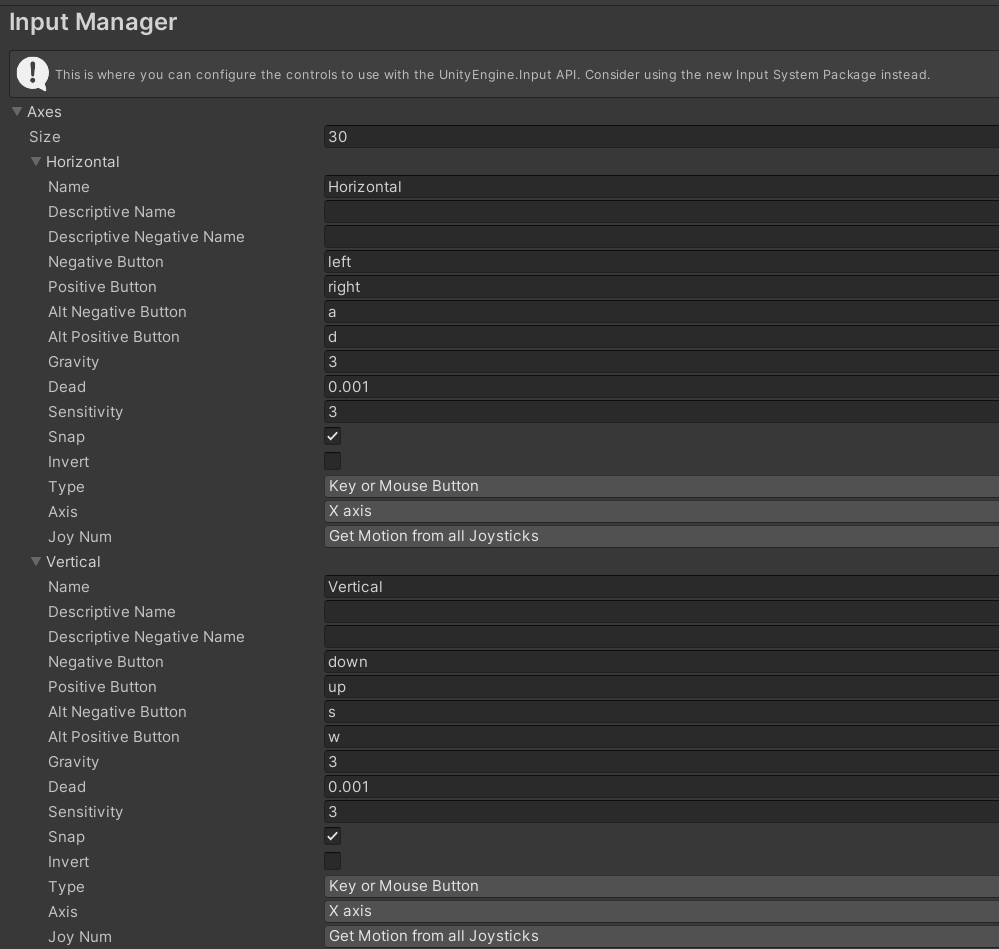
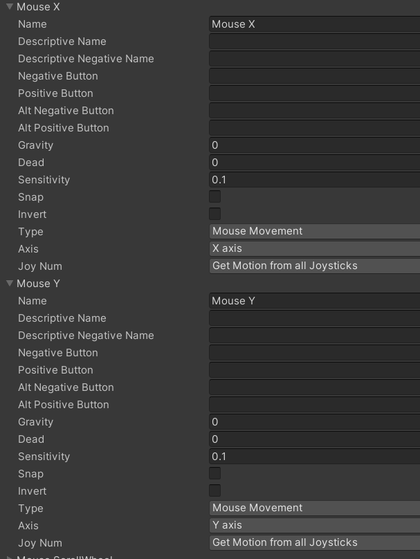
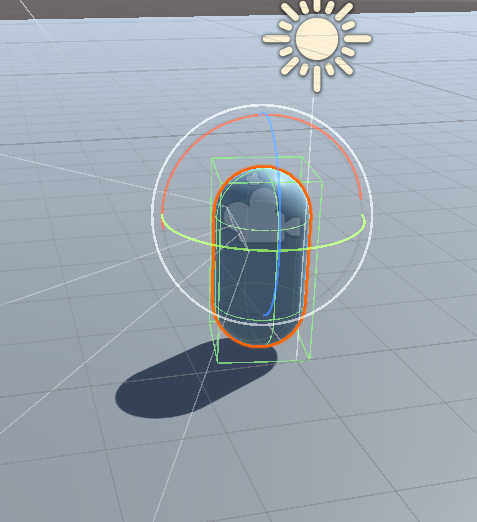

Unity Version : 2022.3.16f1 LTS
[2024 컴퓨터공학과 캡스톤디자인 - Next Reality](2024%20컴퓨터공학과%20캡스톤디자인%20-%20Next%20Reality.md)

# 캐릭터 움직임 구현

Edit → Project Manager → Input Manager → Axes에 있는 Horizontal, Vertical을 활용



Horizontal이 A, D키 Vertical이 W, S키임

```csharp
// CharacterMove.cs

using System.Collections;
using System.Collections.Generic;
using UnityEngine;

public class NewBehaviourScript : MonoBehaviour
{

    public Transform cameraTransform;
    public CharacterController characterController;

    public float moveSpeed = 10f;
    public float jumpSpeed = 10f;
    public float runSpeed = 2f;

    public float gravity = -20f;

    float yVelocity = 0;

    void Start()
    {
        
    }
    void Update()
    {
        float input_h = Input.GetAxis("Horizontal"); // A, D키 입력
        float input_v = Input.GetAxis("Vertical"); // W, S키 입력

        Vector3 moveDirection = new Vector3(input_h, 0, input_v);
        moveDirection = cameraTransform.TransformDirection(moveDirection);
        
        moveDirection *= moveSpeed;
        if (Input.GetKey(KeyCode.LeftShift)) // 좌 쉬프트 = 달리기
        {
            moveDirection *= runSpeed;
        }
   
        if (characterController.isGrounded) // 캐릭터가 땅에 붙어있을 때
        {
            yVelocity = 0;
            if (Input.GetKeyDown(KeyCode.Space)) // 스페이스바 누르면 점프
            {
                yVelocity = jumpSpeed;
            }

        }

        yVelocity += (gravity * Time.deltaTime);

        moveDirection.y = yVelocity;

        characterController.Move(moveDirection * Time.deltaTime);

    }
}
```

WASD로 이동, Shift로 달리기, Space로 점프 구현함

# 카메라 움직임 구현

Edit → Project Manager → Input Manager → Axes에 있는 Mouse X, Mouse Y 활용


```csharp
// CameraMove.cs
using System.Collections;
using System.Collections.Generic;
using UnityEngine;

public class CameraMove : MonoBehaviour
{
    public float sensitivity = 200f;
    float rotationX;
    float rotationY;

    void Start()
    {
        
    }

    
    void Update()
    {
        float mouseX = Input.GetAxis("Mouse X");
        float mouseY = Input.GetAxis("Mouse Y");

        rotationX += mouseX * sensitivity * Time.deltaTime;
        rotationY += mouseY * sensitivity * Time.deltaTime;

        rotationX = rotationX > 35f ? 35f : rotationX;
        rotationX = rotationX < -30f ? -30f : rotationX;

        rotationY = rotationY > 35f ? 35f : rotationY;
        rotationY = rotationY < -30f ? -30f : rotationY;

        transform.eulerAngles = new Vector3(-rotationY, rotationX, 0);
    }
}
```

카메라 회전에 관한 추가 그림


# 카메라가 아니라 캐릭터가 돌아감

이유 : 카메라를 캐릭터에 붙여놓고, 캐릭터를 돌리니까 카메라를 돌리는 것처럼 보였던 것 뿐임

해결 방안 : cameraMove.cs을 카메라에 붙이고, 캐릭터의 CharacterMove.cs를 일부 수정함

```csharp
// CharacterMove.cs

using UnityEngine;

public class CharacterMove : MonoBehaviour
{

    ...
    void Update()
    {
        CharacterMoving(); // WASD 이동 부분을 따로 함수로 뺌
        CharacterRotationX(); // 마우스 좌우로 돌리면 캐릭터가 직접 돌게
    }
		
    void CharacterMoving()
    {
        float input_h = Input.GetAxis("Horizontal"); // A, D키 입력
        float input_v = Input.GetAxis("Vertical"); // W, S키 입력

        Vector3 moveDirection = new Vector3(input_h, 0, input_v);
        moveDirection = cameraTransform.TransformDirection(moveDirection);

        moveDirection *= moveSpeed;
        if (Input.GetKey(KeyCode.LeftShift)) // 좌 쉬프트 = 달리기
        {
            moveDirection *= runSpeed;
        }

        if (characterController.isGrounded) // 캐릭터가 땅에 붙어있을 때
        {
            yVelocity = 0;
            if (Input.GetKeyDown(KeyCode.Space)) // 스페이스바 누르면 점프
            {
                yVelocity = jumpSpeed;
            }

        }

        yVelocity += (gravity * Time.deltaTime);

        moveDirection.y = yVelocity;

        characterController.Move(moveDirection * Time.deltaTime);
    }

    void CharacterRotationX()
    {
        float mouseX = Input.GetAxis("Mouse X");

        rotationX += mouseX * sensitivity * Time.deltaTime;

        this.transform.eulerAngles = new Vector3(0, rotationX, 0);
    }
}
```

```csharp
// CameraMove.cs

public class CameraMove : MonoBehaviour
{
    float sensitivity;
    float rotationY;

    GameObject parentCharacter;

    private void Awake()
    {
        // 부모 객체 (캐릭터) 가져오기
        parentCharacter = this.transform.parent.gameObject;
        // 캐릭터의 sensitivity를 그대로 가져옴
        sensitivity = parentCharacter.GetComponent<CharacterMove>().sensitivity;
    }
		...
    void Update()
    {
        CameraRotationY(); // 마우스 위 아래로 돌리면 카메라만 움직이게
    }

    void CameraRotationY()
    {
        float mouseY = Input.GetAxis("Mouse Y");

        rotationY += mouseY * sensitivity * Time.deltaTime;
		
				// 부모 객체의 회전 각도를 가져다 사용
        Vector3 parentAngle = parentCharacter.transform.eulerAngles;

        // 카메라를 위, 아래로 회전시킬 때 제한을 설정
        rotationY = rotationY > 35f ? 35f : rotationY;
        rotationY = rotationY < -30f ? -30f : rotationY;

        transform.eulerAngles = new Vector3(-rotationY, parentAngle.y, 0);
    }
}
```



이제 마우스를 아래로 내린다고 해서 캐릭터 자체가 숙이지 않음!

# 참고자료

[[Unity3D 개발] 키보드 방향키로 플레이어 움직임과, 1인칭 카메라 시점이동 구현하기](https://acredev.tistory.com/18)

[C# 삼항연산자(Ternary Operator)로 간결한 코딩을!](https://spaghetti-code.tistory.com/51)

[[Unity] GetAxis - 마우스 입력 제어](https://blog.naver.com/khagaa/30128494286)

[[Unity] 유니티 게임 오브젝트를 찾는 방법 - GameObject](https://codeposting.tistory.com/entry/Unity-유니티-게임오브젝트-transform-방법-GameObject-find)

[[Unity] 유니티 다른 오브젝트 컴포넌트, 스크립트 변수 접근하기](https://blog.naver.com/an_4_gel/222772489320)

[[Unity] 트랜스폼(Transform) 회전(Rotation)](https://ssabi.tistory.com/24)
