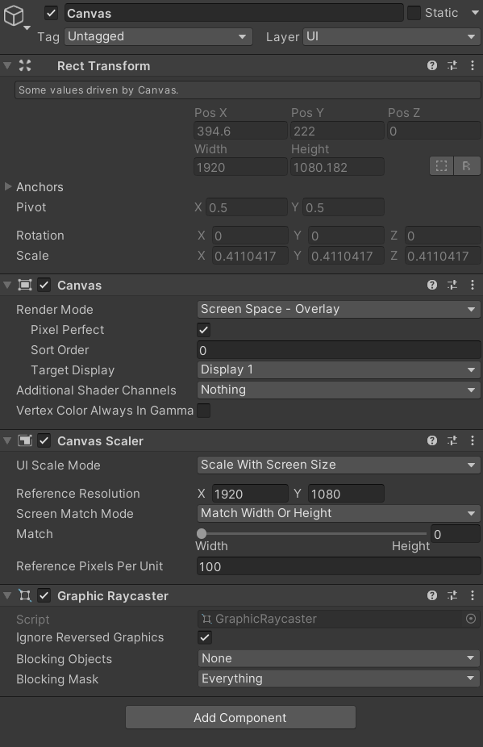
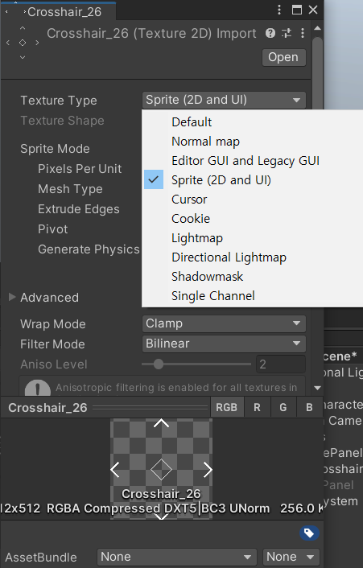
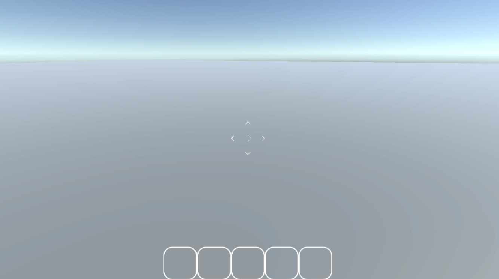
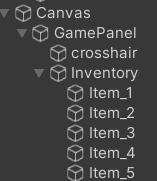

Unity Version : 2022.3.16f1 LTS

## 캔버스 생성 및 기본 설정

UI를 만들기 위해서는 3D 공간 위에 2D 평면을 입혀야 함

그때 사용되는 객체가 캔버스임

캔버스를 생성하면 캔버스와 이벤트 시스템이 동시에 생성됨

이벤트 시스템은 캔버스에 입력을 받았을 때 처리하는 컴포넌트라고 생각

데스크탑 게임의 경우 기본적으로 16:9 스케일을 주로 사용하기 때문에, 

Game → Aspect를 16:9로 설정한다.

아래는 캔버스의 기본 설정임

캔버스 스케일러는 해상도가 달라졌을 때 캔버스의 내용을 어떻게 변형시킬 것인지를 설정함

초기값은 Constant Pixel Size로 되어있는데, 이를 사용하면 픽셀 값이 고정이 되기 때문에

화면 비율에 맞게 알아서 조절해주는 Scale With Screen Size를 선택함

이후 아래에 있는 Reference Resolution은 가장 자주 사용되는 16:9 스케일인 1920:1080을 입력

## 이미지 첨부

Panel → Create Empty (오브젝트를 그룹짓기 위한 용도) → Image

jpg, png같은 일반 이미지는 바로 들어가지 못함

스프라이트로 변경해주어야 함

### 일반 이미지를 스프라이트로 변경하는 방법

이미지 우클릭 → properties → Texture Type에서

Sprite로 변경함

변경이 완료되었으면

Image 컴포넌트의 Source Image를 

방금 변경한 Sprite로 설정해주면 완료

24.01.18 인게임 UI 결과물

## 참고자료

[3D 쿼터뷰 액션게임 - UI 배치하기 [유니티 기초 강좌 B51]](https://youtu.be/N4PLRkupABM)

[유니티 UI 속성 (Panel, Button, Text, Input Field)](https://notyu.tistory.com/47)

[유니티 UI 버튼(Button) 기초 및  OnClick 기능 구현](https://twoicefish-secu.tistory.com/10)

[유니티 스프라이트 (Sprite)](https://notyu.tistory.com/43)
