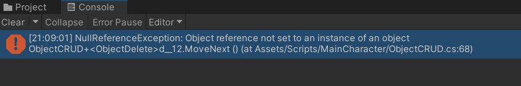
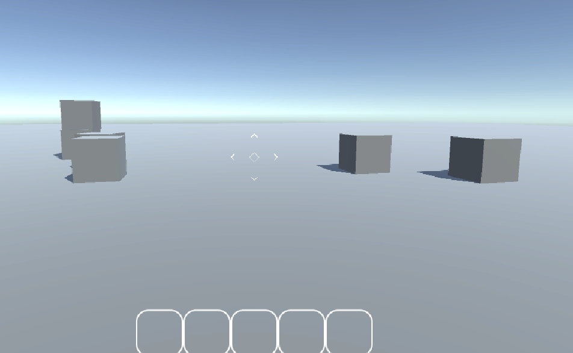

Unity Version : 2022.3.16f1 LTS

## 오브젝트 생성과 삭제 구현

### 레이캐스트 공부

RaycastHit 구조체와 Physics.Raycast 함수를 활용함


Physics.Raycast 함수에 출력값으로 RaycastHit 구조체를 넣으면

Ray가 부딛친 위치(Point), 거리(Distance), 부딛친 객체(Transform)를 알 수 있음

```csharp
// CharacterMove.cs

void ObjectCRUD()
{
    var ScreenCenter = new Vector3(cam.pixelWidth / 2, cam.pixelHeight / 2);
    Ray ray = cam.ScreenPointToRay(ScreenCenter);

    if (Input.GetMouseButton(1)) // 오브젝트 생성 (Create)
    {
        bool isHit = Physics.Raycast(ray, out hit, maxInstantiateRange, InstantiateMask);

        // hit 성공 : hit 한 지점 + 물체의 높이
        // hit 실패 : 최대 raycast 길이만큼
        Vector3 spawn_point = isHit
                ? hit.point + new Vector3(0, onMyHand.transform.localScale.y / 2, 0)
                : cam.transform.position + cam.transform.forward * maxInstantiateRange;
        Instantiate(onMyHand, spawn_point, Quaternion.identity);
    }

    if (Input.GetMouseButton(0))
    {
        bool isHit = Physics.Raycast(ray, out hit, maxInstantiateRange, DestroyMask);
        if (isHit) Destroy(hit.transform.gameObject);
    }
}
```

마우스 우클릭으로 오브젝트 생성, 좌클릭으로 오브젝트 파괴를 구현함

기능은 돌아가지만, 이 코드대로 작성하면 **우클릭을 누르는 동안 계속 오브젝트가 생성됨**

따라서 코드를 분리하고, **코루틴을 사용하기로 결정**

```csharp
// ObjectCRUD.cs
IEnumerator ObjectCRUDEnumerator()
{
    while (Application.isPlaying)
    {
        if (Input.GetMouseButton(1)) // 오브젝트 생성 (Create)
        {
            bool isHit = Physics.Raycast(ray, out hit, maxInstantiateRange, instantiateMask);

            // hit 성공 : hit 한 지점 + 물체의 높이
            // hit 실패 : 최대 raycast 길이만
            Vector3 spawn_point = isHit
                    ? hit.point + new Vector3(0, onMyHand.transform.localScale.y / 2, 0)
                    : cam.transform.position + cam.transform.forward * maxInstantiateRange;
            Instantiate(onMyHand, spawn_point, Quaternion.identity);
            yield return (0.1f);
        }

        if (Input.GetMouseButton(0)) // 오브젝트 삭제 (Delete)
        {
            bool isHit = Physics.Raycast(ray, out hit, maxInstantiateRange, destroyMask);
            if (isHit) Destroy(hit.transform.gameObject);
            yield return (0.1f);
        }
    }
}
```

### 문제 발생!

이대로 돌렸더니 유니티가 먹통이 됨!

플레이 버튼을 눌렀을 때 무한로딩에 빠짐..

### 첫 번째 해결 시도

while 부분에 아무런 버튼 입력이 없었을 때를 처리해주지 않은 것 같아서 아래 코드를 추가함

```csharp
yield return null
```

#### 결과

먹통은 없어졌는데 문제는 오브젝트가 삭제가 안됨

그리고 원하던게 무한생성 막으려고 0.1초 딜레이 넣은거였는데 그게 안먹음


진짜 왜이래

### 두 번째 해결 시도

Character Move에서 전부 상속받게 해놨는데

그 과정에서 설정이 일부 날라갔었던 것 같음

(위가 날라간 내용, 아래가 원래 설정했던 내용)


그래서 이왕 날라간 김에 권한도 분리하기로 함

CharacterMove.cs 에 모여있던 InstantiateMask, DestroyMask를 ObjectCRUD.cs로 옮김


권한이 분리되기 보기가 더 편함

#### 결과

여전히 삭제가 안되고 딜레이도 안먹힘.

### 세 번째 해결 시도

애초에 코드를 잘못 작성했었음

```csharp
// 잘못된 작성법
yield return (0.1f)
```

```csharp
// 올바른 작성법
yield return new WaitForSecondsRealtime(0.1f)
```

내가 원하는 내용은 오브젝트 생성, 삭제가 스팸처럼 되지 않도록 

한 번 실행되고 실제 시간 기준 0.1초 지난 이후에 다시 실행되도록 만드는 것이었음

#### 결과


마구잡이로 생성되던거는 어느정도 나아짐 다만 여전히 삭제가 안됨..

### 네 번째 해결 시도

한 코루틴에 키 입력이 두개가 바인딩된게 문제인가 싶어서,

ObjectCRUDEnumerator를 ObjectCreate와 ObjectDelete로 분리했음

```csharp
// ObjectCRUD.cs
IEnumerator ObjectCreate()
{
    while (Application.isPlaying)
    {
        if (Input.GetMouseButton(1)) // 오브젝트 생성 (Create)
        {
            bool isHit = Physics.Raycast(ray, out hit, maxInstantiateRange, instantiateMask);

            // hit 성공 : hit 한 지점 + 물체의 높이
            // hit 실패 : 최대 raycast 길이만큼
            Vector3 spawn_point = isHit
                    ? hit.point + new Vector3(0, onMyHand.transform.localScale.y / 2, 0)
                    : cam.transform.position + cam.transform.forward * maxInstantiateRange;
            Instantiate(onMyHand, spawn_point, Quaternion.identity);
            yield return new WaitForSecondsRealtime(0.1f);
        }
        yield return null;
    }
}
IEnumerator ObjectDelete()
{
    while (Application.isPlaying)
    {
        if (Input.GetMouseButton(0))
        {
            bool isHit = Physics.Raycast(ray, out hit, maxInstantiateRange, destroyMask);
						Debug.Log("Destroy");
            if (isHit) Destroy(hit.transform.gameObject);
            yield return new WaitForSecondsRealtime(0.1f);
        }
        yield return null;
    }
}
```

#### 결과

여전히 삭제가 안됨!!! 분명히 로그에는 찍히는데!!!


분명 찍히고있는데 왜??



근데 hit.transform.ToString()으로 디버그 로그 찍으니까 막상 오류남

### 다섯 번째 해결 시도

ObjectDelete에서 광선이 Hit하지 않았을 때의 예외처리를 하지 않은 것 같아서 추가했음

```csharp
// ObjectCRUD.cs >> ObjectDelete()
IEnumerator ObjectDelete()
{
    while (Application.isPlaying)
    {
        if (Input.GetMouseButton(0))
        {
            Ray ray = cam.ScreenPointToRay(ScreenCenter);
            bool isHit = Physics.Raycast(ray, out RaycastHit hit, maxInstantiateRange, destroyMask);
            if (isHit)
            {
                Destroy(hit.transform.gameObject);
                yield return new WaitForSecondsRealtime(0.1f);
            }
            else
            {
                yield return null;
            }
            
        }
        yield return null;
    }
}
```

그리고 오류가 나던 디버그 찍던 부분을 삭제했음

빈 공간을 클릭했을 때 GameObject가 없어서 null 오류가 뜬 것으로 보임

#### 결과

성공함!!!!!!!!!!!!!!!!!!!



원래 커서 자리에 블럭이 있었는데, 좌클릭으로 삭제한 모습

처음에 구현하고자 했던 딜레이 있는 오브젝트 생성, 삭제를 모두 구현했음!

## 배운 점

1. 코루틴을 사용할 때 너무 많은 기능을 한 번에 집어넣지 말자
2. 뭔가 이상하다 싶으면 설정값을 돌아보자
3. 어떨 때에는 로그를 찍을 때 문제가 생길 수도 있다 (ex. Null Error)

## 참고자료

[[유니티] RaycastHit 구조체](https://blog.naver.com/happybaby56/221370502930)

[[Unity3D] GameObject 생성과 삭제. Instantiate와 Destroy](https://cpp11.tistory.com/15)

[Unity : Ray, Raycast 및 RaycastHit](https://coding-shop.tistory.com/121)

[유니티 - 무한 루프를 간편히 방지하기](https://rito15.github.io/posts/unity-memo-prevent-infinite-loop/)
