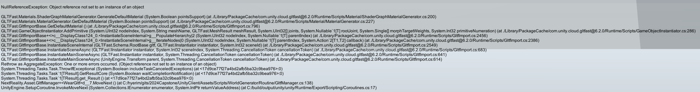

외부 라이브러리 사용 시  
NullReferenceException 뜨는 경우 있음

라이브러리에서 사용하는 데이터가 **빌드 후에도 포함이 되어있는지, 리소스 폴더에 들어가 있는지 꼭!! 확인해볼 것**

빌드 후 디버그 결과, glb 파일은 다운로드 하지만 이를 입히는 과정에서  
아래와 같은 오류를 낸다는 것을 확인함

다른 팀원이 오류 내용을 보고, 리소스 파일에 셰이더 데이터를 추가하였더니 해결되었음