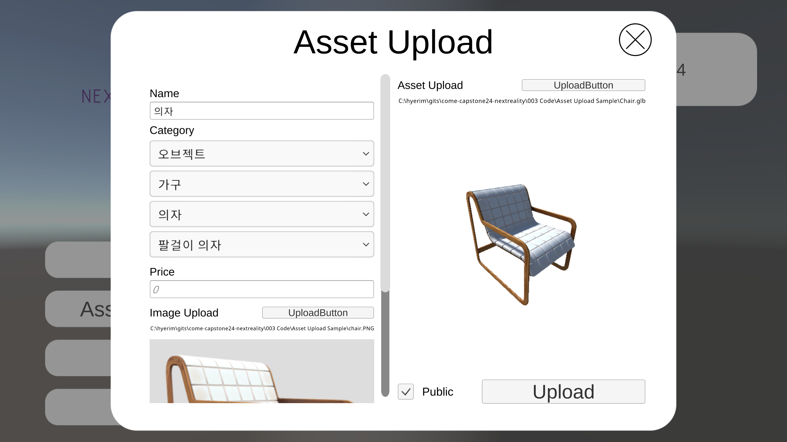
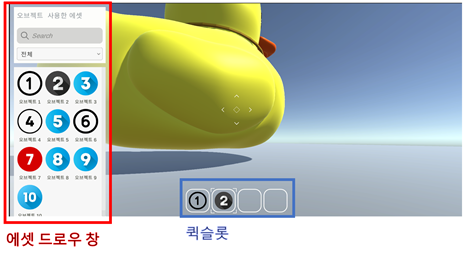
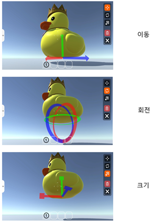
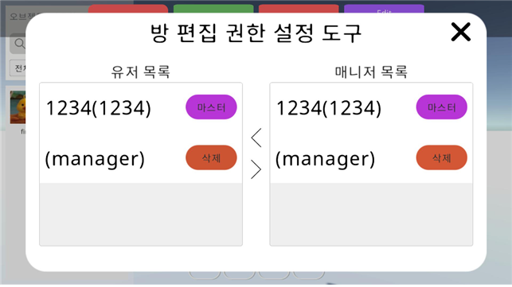
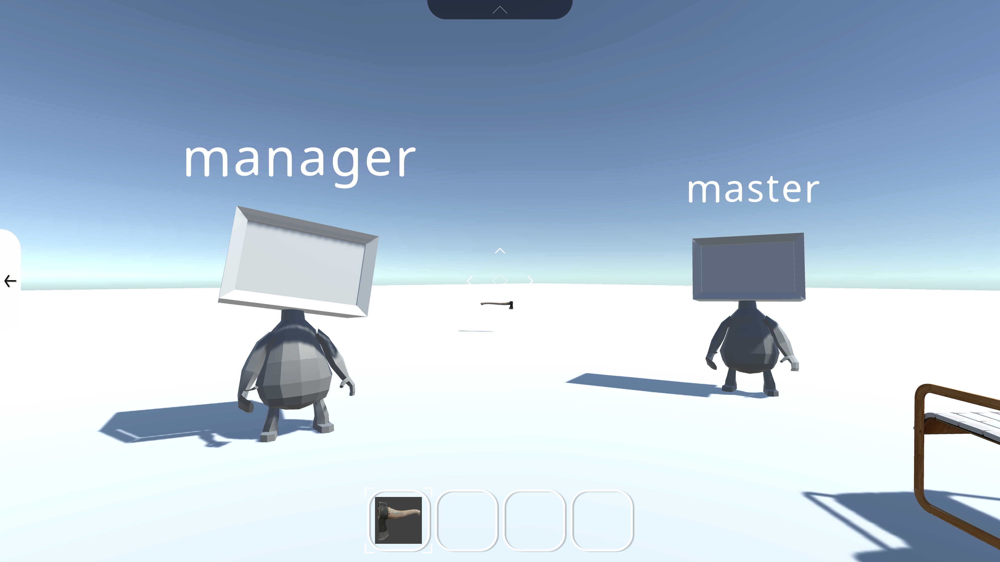
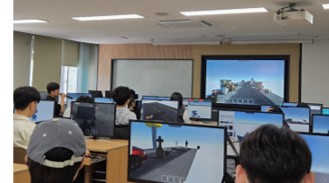

팀명 : Next Reality

진행기간 : 2024.12 ~ 2025.11  

주제 : 
캡스톤디자인 1 ) 유니티 기반 3D 대규모 다중 사용자 온라인 샌드박스 메타버스 플랫폼  
캡스톤디자인 2 ) 대규모 다중 사용자 온라인 메타버스 플랫폼을 지원하기 위한 효과적인 서버/클라이언트 구조에 대한 연구  

개발 목표 :  
본 캡스톤디자인은 사용자가 3D 에셋을 생산 및 판매가 가능한 플랫폼을 구현한다. 기존 Unity 기반 어플리케이션은 기본적으로 개발 단계에서 임포트하여 식별된 에셋만을 활용할 수 있다. 그러나, UGC 플랫폼 환경을 구축하기 위하여 Unity 기반 어플리케이션의 업데이트나 추가 개발 없이도 실시간으로 3D 에셋을 생성, 활용 가능한 방법을 마련한다. 본 캡스톤디자인은 사용자 수준의 클라이언트에서 3D 모델링을 업로드하여 높은 퀄리티의 에셋을 생산 가능하도록 인터페이스를 제공하고, 곧바로 사용자가 유용하게 활용할 수 있는 환경을 조성하는 것을 목표로 한다. 이를 통해 어플리케이션의 콘텐츠 확장을 개발자에 의존하는 것이 아니라 다수의 사용자가 다양한 콘텐츠를 추가할 수 있게 한다.

동작 사진 :  

    

  

  

  

시스템 구성도 :   
  

담당 파트 :  

- 팀장
- 전반적인 행정 처리 (캡스톤디자인 지원 사업 3개 참여)
- 문서화
- Unity Client 일부 담당
- 에셋, 맵, 로그인 서버 관리
- 자체 게임 서버 제작 (Go, UDP + Http 사용)
    - 멀티플레이 서버는 빠른 동기화를 위해 UDP를 활용하여 제작함
    - 크리에이터 권한 목록 확인은 HTTP를 활용하여 제작함
    - 크리에이터 권한 편집은 UDP 서버를 통해서만 가능하도록 함
    - 특정 문자열이 오면 내부 처리 후 받은 내용을 모든 클라이언트에게 broadcast
    - 유저 아이디와 유저 IP의 쌍을 딕셔너리 두 개를 사용해 관리함. 아이디로 IP를 검색하기도 하고 IP로 아이디를 검색하기도 하기 때문
    - 커맨드$보낸유저의ID;보낸시간;(커맨드에 따른 추가 메시지)

|커맨드|수신 시기|내부 동작|
|---|---|---|
|PlayerJoin|유저가 맵에 입장할 때|맵ID dict에 유저ID 저장|
|PlayerLeave|유저가 퇴장할 때|맵ID dict에서 유저ID 삭제|
|PlayerMove|유저가 움직일 때|X|
|AssetCreate|유저가 에셋을 설치할 때|메시지 발신 유저의 권한 확인|
|AssetMove|유저가 에셋을 움직일 때|메시지 발신 유저의 권한 확인|
|AssetDelete|유저가 에셋을 삭제할 때|메시지 발신 유저의 권한 확인|
|AssetSelect|유저가 에셋을 선택할 때|메시지 발신 유저의 권한 확인 및 에셋 Lock List에 추가|
|AssetDeselect|유저가 에셋을 선택 해제 했을 때|메시지 발신 유저의 권한 확인 및 에셋 Lock List에서 삭제|
|MapReady|유저가 맵에 입장하고, 맵 데이터를 받았을 때|맵이 저장 된 시점 이후의 에셋 관련 로그를 발신자에게 보냄으로써 변경사항을 동기화 할 수 있도록 함|
|PlayerJump|유저가 점프할 때|X|
|MapInit|맵을 초기화할 때|메시지 발신 유저의 권한 확인|
|ManagerEdit|사용자 권한을 추가/삭제할 때|발신 유저가 방을 생성한 유저인지 확인|

해당 표의 모든 내부 동작 이전에는 접속한 사용자인지 검증하는 과정이 포함됨

또한 내부 동작 이후에는 브로드캐스팅이 진행됨

중앙서버의 과부화를 위해, 방에 접속하려는 사용자는 해당 방에 이미 로딩이 완료된 사용자가 있을 경우 그 사용자의 IP를 받아 P2P형식으로 데이터를 다운로드 함