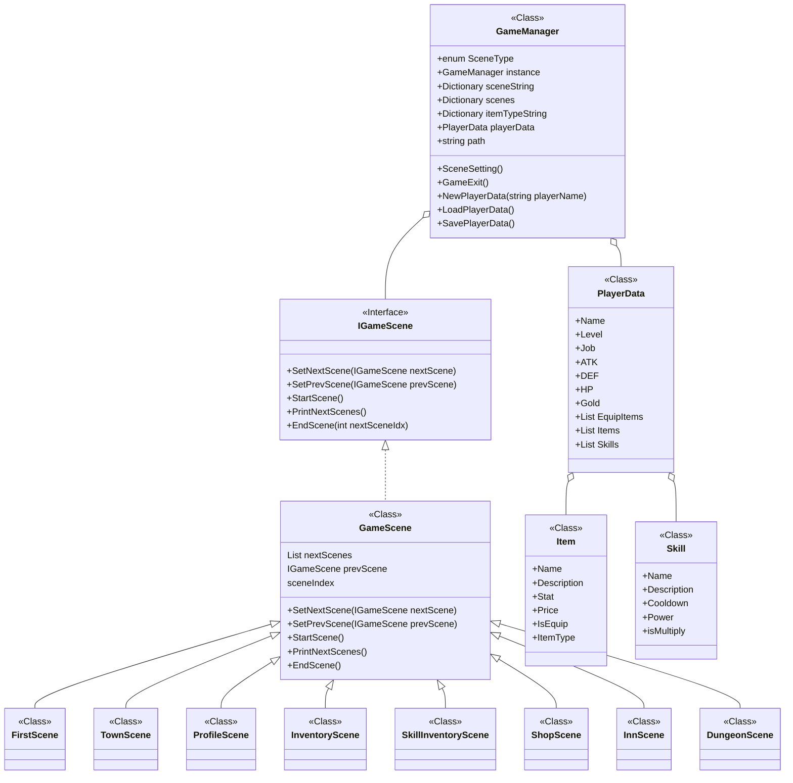

# 오늘 학습 키워드 

델리게이트, 람다, LINQ
# 오늘 학습 한 내용을 나만의 언어로 정리하기 

## 델리게이트, 람다, LINQ

### 델리게이트

- 메소드를 참조하는 타입
- 함수 포인터와 유사함
- 델리게이트를 이용하면 메소드 자체를 매개변수로 전달하거나 변수로 할당할 수 있음
- 함수를 변수로 저장할 수 있다고 생각하기

```csharp
// 예시
delegate int Calculate(int x, int y);

static int Add(int x, int y)
{
	return x + y;
}

class Program
{
	static void Main()
	{
		Calculate cal = Add;
		int result = cal(3, 5);
		Console.WriteLine("결과 : " + result);
	}
}
```

- 델리게이트에 하나 이상의 메소드를 등록할 수도 있음
```csharp
// 예시
delegate void MyDelegate(string message);

static void Method1(string message)
{
    Console.WriteLine("Method1: " + message);
}

static void Method2(string message)
{
    Console.WriteLine("Method2: " + message);
}

class Program
{
    static void Main()
    {
        // 델리게이트 인스턴스 생성 및 메서드 등록
        MyDelegate myDelegate = Method1;
        myDelegate += Method2;

        // 델리게이트 호출
        myDelegate("Hello!");

        Console.ReadKey();
    }
}
```

- event와 delegate의 차이 : event는 delegate와 달리 할당 연산자(=)를 사용할 수 없고, +=와 -=만 사용 가능함. 또한 클래스 외부에서는 사용할 수 없음.

```csharp
// 예제
public delegate void EnemyAttackHandler(float damage);

public class Enemy
{
	public event EnemyAttackHandler OnAttack;

	public void Attack(float damage)
	{
		OnAttack?.Invoke(damage);
		// ? = null 조건부 연산자
		// null 참조가 아닌 경우에만 멤버에 접근하거나 메소드를 호출함
	}
}


public class Player
{
	public void HandleDamage(float damage)
	{
		Console.WriteLine("플레이어가 {0}의 데미지를 입었습니다.", damage);
	}
}

static void Main()
{
	Enemy enemy = new Enemy();
	Player player = new Player();

	enemy.OnAttack += player.HandleDamage;
	enemy.Attack(10.0f);
}

// 플레이어 클래스에 있는 HandleDamage 함수를 적 클래스에 있는 OnAttack에 저장하여
// 적이 공격을 할 때 플레이어의 HandleDamage가 실행되게 함
```


### 람다

- 람다 : 익명 메소드
- 메소드의 이름 없이 메소드를 만들 수 있다.

```csharp
// 예제
Calculate calc = (x, y) =>
{
	return x + y; // 여러 줄 코드
};

Calculate calc = (x, y) => x + y; // 한 줄 코드
```

- 델리게이트랑 같이 사용하면 용이함
```csharp
// 예시
delegate void MyDelegate(string message)

class Program
{
	static void Main()
	{
		MyDelegate myDelegate = (message) =>
		{
			Console.WriteLine("람다식을 통해 전달된 메세지 : " + message);
		};

		myDelegate("안녕하세요!");

		Console.ReadKey();
	}
}
```

### Func, Action

- Func과 Action은 둘 다 델리게이트를 대체하는 미리 정의된 제네릭 형식
- Func : 값을 반환하는 메소드를 나타내는 델리게이트. Func<int, string>은 int를 입력받아 string을 반환하는 형태
- Action : 값을 반환하지 않는 메소드를 나타내는 델리게이트. Action<int, string>은 int와 string을 입력받아 아무런 값을 반환하지 않는 형태.

```csharp
// Func 예제
int Add(int x, int y) return x + y;

Func<int, int, int> addFunc = Add;
int result = addFunc(3, 5); // x = 3, y = 5, result = 8
Console.WriteLine("결과 : " + result);

// Action 예제
void PrintMessage(string message) Console.WriteLine(message);

Action<string> printAction = PrintMessage;
printAction("Hello World!");
```

### LINQ

- .NET 프레임워크에서 제공되는 쿼리 언어 확장
- Language INtegrated Query
- 데이터 소스에서 데이터를 쿼리하고 조작하는데 사용됨.
- 필터링, 정렬, 그룹화, 조인 등 다양한 작업 수행 가능

```csharp
// 구조
var result = from 변수 in 데이터소스
			[where 조건식]
			[orderby 정렬식 [, 정렬식...]]
			[select 식];

// 예시 : 1부터 5까지의 수 중에서 짝수인 수만 구하기
List<int> numbers = new List<int> {1, 2, 3, 4, 5};

var evenNumbers = from num in numbers
				  where num % 2 == 0
				  select num;

foreach(var num in evenNumbers)
{
	Console.WriteLine(num);
}

```

## 고급 자료형 및 기능

### Nullable

- 값형 변수에 null 값을 지정할 수 있게 됨
- ?를 사용해서 만듬

```csharp
// 예시
int? nullableInt = null;

nullableInt = 10;

if(nullableInt.HasValue)
{
	Console.WriteLine("nullableInt 값: " + nullableInt.Value);
}
else
{
	Console.WriteLine("nullableInt는 null입니다.");
}

// null 병합 연산자 사용
int nonNullableInt = nullableInt ?? 0; // nullableInt가 null이면 0을 집어넣음
Console.WriteLine("nonNullableInt 값: " + nonNullableInt);
```

### StringBuilder

- 문자열 조작이 용이하고, 가변성이 있으며, 효율적인 메모리 관리를 해줌
- 주요 메소드
	- Append : 문자열 뒤에 추가
	- Insert : 문자열을 지정한 위치에 삽입
	- Remove : 지정한 위치에서 문자열 제거
	- Replace : 문자열 일부를 다른 문자열로 대체
	- Clear : StringBuilder의 내용을 모두 지움

```csharp
// 예제
StringBuilder sb = new StringBuilder();

sb.Append("Hello");
sb.Append(" ");
sb.Append("World");
// sb = Hello World

sb.Insert(5, ", ");
// sb = Hello, World

sb.Replace("World", "C#");
// sb = Hello, C#

sb.Remove(5, 2);
// sb = HelloC#

string result = sb.ToString();
Console.WriteLine(result);
```


## 텍스트 RPG 만들기

## 기획

- 필수 기능 
	- 게임 시작 화면
	- 상태 보기
	- 인벤토리
	- 장비 장착 관리
	- 상점
	- 아이템 구매
- 도전 기능
	- 아이템 정보 클래스 / 구조체 활용
	- 아이템 정보 배열 관리
	- 나만의 아이템 추가
	- 휴식기능 추가
	- 아이템 판매
	- 장착 개선
	- 레벨업 기능 추가
	- 던전 추가
	- 게임 저장 추가

### 필요 씬

1. 게임 시작 (새로하기 / 이어하기)
	- 이동가능 => 마을
	- 돌아가기 => 게임종료
2. 마을
	- 이동가능 => 인벤토리, 상점, 여관, 던전
	- 돌아가기 => 게임종료
3. 인벤토리 (장비 장착, 스킬 장착)
	- 돌아가기 => 마을
4. 상점
	- 돌아가기 => 마을
5. 여관 (여기서 휴식 or 저장)
	- 돌아가기 => 마을
6. 던전
	- 돌아가기 => 마을

어느 곳에서든 0번은 늘 돌아가기 or 게임종료

### 플레이어 데이터

1. 레벨
2. 이름
3. 직업
4. 공격력
5. 방어력
6. 체력
7. 골드
8. 장착한 아이템
9. 보유한 스킬

### 추가 아이디어

- 장착 가능 부위를 머리/상의/하의/무기 로 4 부위 나누기
- 직업에 따른 스킬 만들기

## 개발



IGameScene 인터페이스를 미리 만들고
GameScene : IGameScene으로 클래스를 만든 후
그 GameScene을 상속하는 씬들을 죄다 만듬

### 다른 분의 아이디어

- 씬을 Stack으로 관리하면 굳이 prevScene을 가지지 않아도 됨

# 학습하며 겪었던 문제점 & 에러 

- 문제&에러에 대한 정의 

지금 구조가 GameScene 내에서 계속 호출하는 방식이라
스택 너무 쌓일 것 같음

- 해결 방법 

상태를 저장하고 변환하는 유한 상태 머신 사용

- 이 문제&에러를 다시 만나게 되었다면? 

고정된 시스템에 대해서 유한 상태 머신을 사용

# 내일 학습 할 것은 무엇인지

유한 상태 머신으로 바꾸니까 다음 씬으로 안넘어가는 문제 발생. 이거 오류 수정해야 함