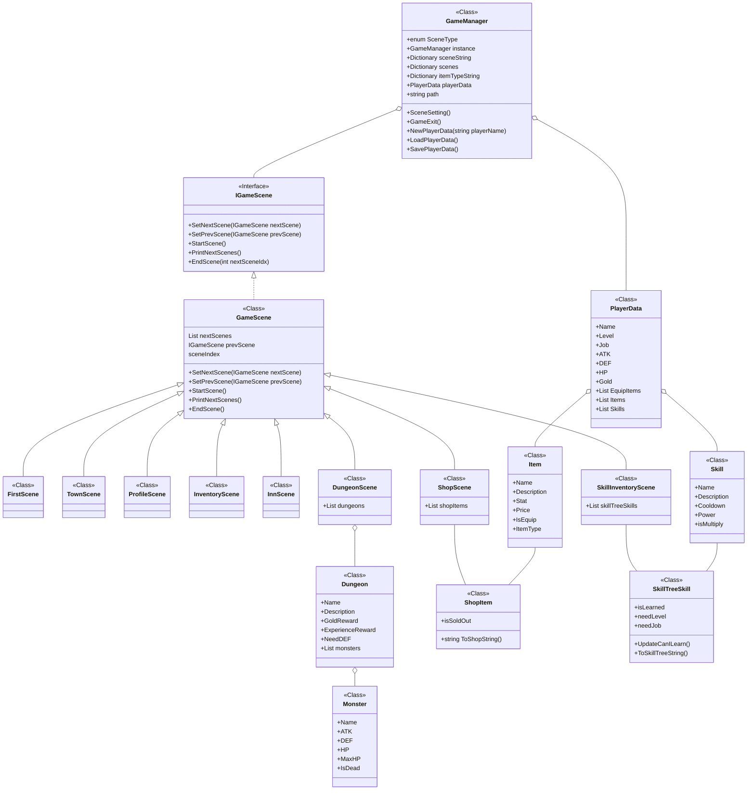

# 오늘 학습 키워드 

Enum 순회, Class, List
# 오늘 학습 한 내용을 나만의 언어로 정리하기 

## Enum을 순회하는 방법

```csharp
public enum Jobs
{
    Warrior,
    Mage,
}
```

이걸 순회하고자 했음.

```csharp
foreach (Jobs job in Enum.GetValues(typeof(Jobs)))
{
	Console.WriteLine(job);
}
```

여기서 Enum.GetValues는 Enum 안에 value값으로 지정된 정수들을 list로 반환함.
Enum.GetValues는 인자로 특정 Enum의 타입 정보를 요구함
그래서 typeof(Jobs)가 필요함.

## >>> Class는 값이 아니고 참조 형식이다 <<< !!!

```csharp
public void EquipmentChanged(int itemIndex, bool isEquip)
{

    Item item = GameManager.instance.playerData.Items[itemIndex];
    Console.Clear();
    if (isEquip)
    {
        Console.WriteLine($"{item.Name} 아이템을 장착했습니다.");
        GameManager.instance.playerData.Items[itemIndex].IsEquip = true;
        if (GameManager.instance.playerData.EquipItem[(int)item.ItemType].IsEquip)
        {
            GameManager.instance.playerData.Items[(x => x.Name == item.Name].IsEquip = false;
        }
        
        GameManager.instance.playerData.EquipItem[(int)item.ItemType] = item;

    }
    else
    {
        Console.WriteLine($"{item.Name} 아이템을 해제했습니다.");
        GameManager.instance.playerData.Items[itemIndex].IsEquip = false;
        GameManager.instance.playerData.EquipItem[(int)item.ItemType] = null;
    }
}
```

위 코드를 보면 알겠지만, item에다가 itemIndex 위치에 맞는 플레이어 아이템을 넣어 두긴 했으나....   
이게 값 복사 형식인줄 알고 무서워서 밑에서 안썼음..  
근데? 생각해보니 클래스는 참조 형식이라 원본 위치 고~대로 가져옴  
내가 바보였다.  

## List에서 특정 조건으로 내부 값 찾기

1. FindIndex를 사용함

```csharp
int index = GameManager.instance.playerData.Items.FindIndex(x => x.Name == item.Name);
if (index >= 0)
{
    GameManager.instance.playerData.Items[index].IsEquip = false;
}

```

2. FirstOrDefault를 사용함

```csharp
var targetItem = GameManager.instance.playerData.Items.FirstOrDefault(x => x.Name == item.Name);
if (targetItem != null)
{
    targetItem.IsEquip = false;
}
```

## 같은 카테고리의 아이템은 하나만 착용하게 하기

```csharp
public void EquipmentChanged(int itemIndex, bool isEquip)
{

    Item item = GameManager.instance.playerData.Items[itemIndex];
    Console.Clear();
    if (isEquip)
    {
        Console.WriteLine($"{item.Name} 아이템을 장착했습니다.");
        item.IsEquip = true;
        Item alreadyEquip = GameManager.instance.playerData.EquipItem[(int)item.ItemType];
        if (alreadyEquip != null && alreadyEquip.IsEquip)
        {
            var alreadyEquipInItems = GameManager.instance.playerData.Items.FirstOrDefault(x => x.Name == alreadyEquip.Name);
            if (alreadyEquipInItems != null) alreadyEquipInItems.IsEquip = false;
        }
        GameManager.instance.playerData.EquipItem[(int)item.ItemType] = item;

    }
    else
    {
        Console.WriteLine($"{item.Name} 아이템을 해제했습니다.");
        item.IsEquip = false;
        GameManager.instance.playerData.EquipItem[(int)item.ItemType] = null;
    }
}
```

1. item을 착용하려는건지 확인 (if (isEquip))
2. alreadyEquip에 item 카테고리로 이미 입고있는 아이템 넣기
3. alreadyEquip이 null이 아니고, IsEquip 확인
4. alreadyEquip을 플레이어의 Items에서 찾은 후 IsEquip false 해주기


## 변경된 구조



Scenes 안에 함수들은 너무 많아서 따로 정리 안함..


## json 저장할 때 쓸만한 것

나중에 써먹으려고 저장함

```csharp
[JsonConverter(typeof(JsonStringEnumConverter))]
```

Enum 형식의 데이터를 json 으로 저장할 때, value인 정수로 저장하는 것이 아니고 key값인 문자열로 저장하는 방식을 쓰도록 함.    

# 학습하며 겪었던 문제점 & 에러 

## 문제 1

- 문제&에러에 대한 정의 

두 마리의 슬라임을 던전에 배치했을 때,
첫 번째 슬라임을 공격해도 두 마리에게 모두 데미지가 일어남
=> 알고보니 같은 오브젝트를 두 번 넣다보니 그냥 그림자 분신술이 일어난 것과 같음

- 해결 방법 

같은 기수 분한테 아이디어를 얻음
슬라임의 부모 클래스인 Monster 안에 새 인스턴스를 반환하는
MakeClone() 함수를 만들어서 그걸 부르는 것

- 새롭게 알게 된 점 

C#은 참조 형태의 깊은 복사를 허용하지 않는다.

- 이 문제&에러를 다시 만나게 되었다면? 

자주 생겨야되는 데이터는 새 인스턴스 반환하는 함수를 만들어두자.

## 문제 2

- 문제&에러에 대한 정의 

분명 파이어볼과 메테오는 법사 전용 스킬인데, 
게임을 껐다가 키면 전사 전용으로 바뀌어 있음.
애초에 직렬화가 제대로 안된것같음.

- 해결 방법 

public 프로퍼티 Get, Set을 만들어 준다

- 새롭게 알게 된 점 

System.Text.Json의 기본 직렬화 정책은 **Public 프로퍼티** 만 직렬/역직렬화 한다.
=> 필드를 무시한다!!!!

- 이 문제&에러를 다시 만나게 되었다면? 

get/set 을 만들어두자!!!


# 내일 학습 할 것은 무엇인지

완성한 TextRPG ReadMe 작성하기
딸기밭 팀프로젝트 진행