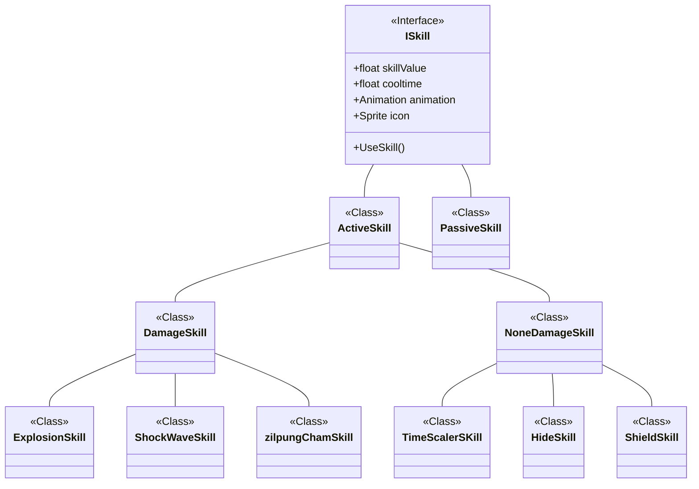

# 오늘 학습 키워드 

ScriptableObejct
# 오늘 학습 한 내용을 나만의 언어로 정리하기 

##  ScriptableObejct

[공식 문서](https://docs.unity3d.com/kr/2022.3/Manual/class-ScriptableObject.html)
[참고 자료](https://youtu.be/7Qt4QNhM4nY)

- 데이터 컨테이너.

예제 : 
적군 NPC의 HP를 각각 저장하는게 아니고 스크립터블 오브젝트 하나를 참조하게 하면,  
적군이 많아져도 용량은 그대로임.  

- 게임 오브젝트에 컴포넌트로 붙일 수 없음.
### SO 만드는 방법

1. C# Class를 하나 만듬
2. MonoBehaviour 대신 ScriptableObject를 상속하게 변경함
3. Strat / Update 문 삭제함
4. 클래스 선언 앞에 CreateAssetMenu 추가함

```csharp
[CreateAssetMenu(fileName = "생성되는 SO이름", menuName = "Assets>Create 안에 보일 메뉴명", order = "몇번째로 표시되게 할 것인지")]
```

5. 이제 클래스 내부에 필드를 만들어줌

```csharp
public class SkillData : ScriptableObject
{
	[SerializeField]
	private string name;
	public string Name {get {return name;}}

...
}
```

스크립트를 이렇게 하나 만든 후, Asset -> Create 안에 보면 SO를 생성하는 버튼이 생겨있음.


## 스킬 만들기



일단 생각해 둔 구조

이후 변경될 수 있음

## 제네릭 싱글톤 코드 공부

[참고자료](https://usingsystem.tistory.com/90)

```csharp
public class SingleTon<T> where T : SingleTon<T>, new() 
{
    protected static T instance;

    public static T GetInstance
    {
        get
        {
            if (instance == null)
            {
                instance = new T();
                instance.Init();
            }
            return instance;
        }
    }

    public virtual void Init()
    {

    }

    public void Release()
    {
        instance = default(T);
    }
}
```


1. public class SingleTon\<T\> where T : SingleTon\<T\>
	- T는 SingleTon\<T\>의 자식클래스거나 자기 자신이어야 함. = CRTP(Cruiously Recurring Template Pattern) 
2. new()
	- T는 매개변수가 없는 public 생성자가 있어야함
	- new() 조건은 다른 조건들과 사용될 때 맨 뒤에 작성되어야 함


## FSM 코드 공부

```csharp
public interface IState // 상태 진입 , 실행, 종료
{
    void Enter();
    void Execute();
    bool Exit(); // 끝났으면 true 아니면 false
}
```

```csharp
public enum StateType { Idle, Move, Attack, HeavyWeapon, Damage, Die , Seat , BulletJump ,Jump,Landing }

public class StateParent : IState
{

    public StateType type; // 상태 타입
    protected Dirrector actor;
    protected float currTime;
    protected float goal; // 목표 시간
    protected bool motionCancel; // 모션 캔슬 가능한지
    public bool MotionCancel { get { return motionCancel; } }

    public StateParent(Dirrector actor, float goal)
    {
        this.actor = actor;
        this.currTime = 0;
        this.goal = goal; 
    }

    public virtual void Enter()
    {
        currTime = 0;
        actor.ChangeAnims(type);
    }
    public virtual void Execute()
    {
        currTime += Time.deltaTime;
    }
    public virtual bool Exit() // 캔슬이 가능하면 true 반환
    {
        if (!MotionCancel && currTime <= goal) return false;
        currTime = 0f;
        return true;
    }
}
```

```csharp
public class StateMachine
{
    StateParent[] states;
    StateParent currStates;
    public Dirrector dirrector;
    public StateMachine(Dirrector dirrector)
    {
        List<StateParent> temp = new List<StateParent>();

        currStates = new IdleState(dirrector, 1);

        this.dirrector = dirrector;
        temp.Add(currStates);
        temp.Add(new MoveState(dirrector, 1));
        temp.Add(new AttackState(dirrector, 1));
        temp.Add(new DamagedState(dirrector, 1));

        states = temp.ToArray();
    }
// 현재 존재하는 상태 : Idle, Move, Attack, Damaged.

    public StateParent Search(StateType type)
    {
        for (int i = 0; i < states.Length; i++)
        {
            if (states[i] == null) continue;
            if (states[i].type == type)
            {
                return states[i];
            }
        }
        Debug.LogError($"{type}스테이트가 존재 하지 않습니다");
        return null;
    }


    public void Change(StateType type)
    {
        if (type == currStates.type) return;

        if (currStates.Exit()) // currsStates의 Exit를 실행함
        {
            currStates = Search(type);
            currStates.Enter();
        }
    }
}
```


# 내일 학습 할 것은 무엇인지

스킬 제작
