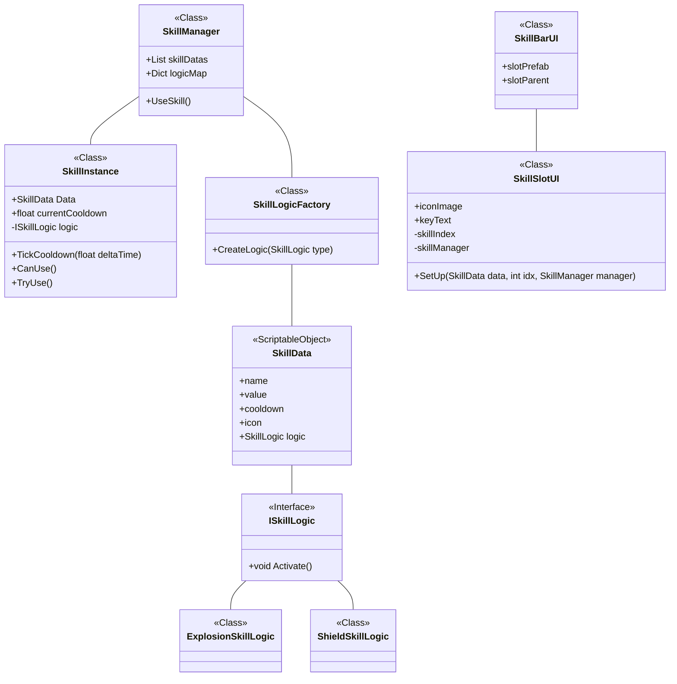

# 오늘 학습 키워드 

FindObjectOfType, Scriptable Object, Factory, 드래그 앤 드롭, 
# 오늘 학습 한 내용을 나만의 언어로 정리하기 

## Find 함수

[참고자료](https://sonnyisback.tistory.com/112)
[참고자료 2](https://blog.naver.com/sorang226/223456569989)

Find 계열 함수는 전반적으로 부하가 심함

## 스킬 시스템 만들기

### 구조도

- Skill Manager : 스킬 관리자
- Skill Instance : 스킬 하나와 1:1 대응으로 가지고 있음. 쿨타임 및 사용 가능 여부 반환
- Skill Logic Factory : 특정 타입에 맞는 Skill Logic 반환
- Skill Data : 스킬의 이름, 값, 쿨타임 등등 가지고 있음. Scriptable Object임.
- ISkill Logic : 모든 스킬은 Activate()가 있어야 함.
- Explosion Skill Logic, Shield Skill Logic... : Skill Data의 enum logic에 맞는 함수들. 실제로는 이게 실행됨.

- SkillBarUI : 우측 하단 스킬바
- SkillSlotUI : 스킬바에 들어가는 슬롯 하나 하나

## 드래그 앤 드롭

|인터페이스|호출 시점|설명|
|---|---|---|
|`IBeginDragHandler`|드래그를 **시작**할 때 1회 호출|오브젝트 위치 변경 시작 시 초기화|
|`IDragHandler`|드래그 중 **계속 호출**됨 (프레임마다)|마우스 따라다니게 처리|
|`IEndDragHandler`|드래그를 **끝냈을 때** 1회 호출|원래 자리로 돌아가거나 drop 처리|

- 원하는 인터페이스를 구현하는 방식으로 사용 가능함.
- 필요 조건 : 
	- 드래그 대상 오브젝트에 CanvasGroup이 있어야 함.
	- Canvas에 GraphicRaycaster, 씬에 EventSystem이 필요함

[참고 자료](https://www.youtube.com/watch?v=BGr-7GZJNXg)

### CanvasGroup

- UI 요소들에 대한 속성을 컨트롤하는 컴포넌트
	- alpha : 투명도
	- interactable : 버튼 등 상호작용 가능 여부
	- blocksRaycasts : 마우스 클릭/터치 등 이벤트 받을 수 있는지 여부
	- ignoreParentGroups : 상위 그룹 설정 무시 여부

## TextRPG 다른 분들의 아이디어

- 메뉴를 방향키로 조작한다.
- 상점 페이지 이동 (리플렉시블)
- 도박장
- 인벤토리 순서대로 정렬
- project 우클릭 -> Add

# 학습하며 겪었던 문제점 & 에러 

- 문제&에러에 대한 정의 

이미지가 보이지가 않았음

- 해결 방법 

width, height가 0이었음...

- 이 문제&에러를 다시 만나게 되었다면? 

확인을 똑띠하자.

# 내일 학습 할 것은 무엇인지

chatgpt 너무 많이써가지고 그거 정리 좀 해야됨