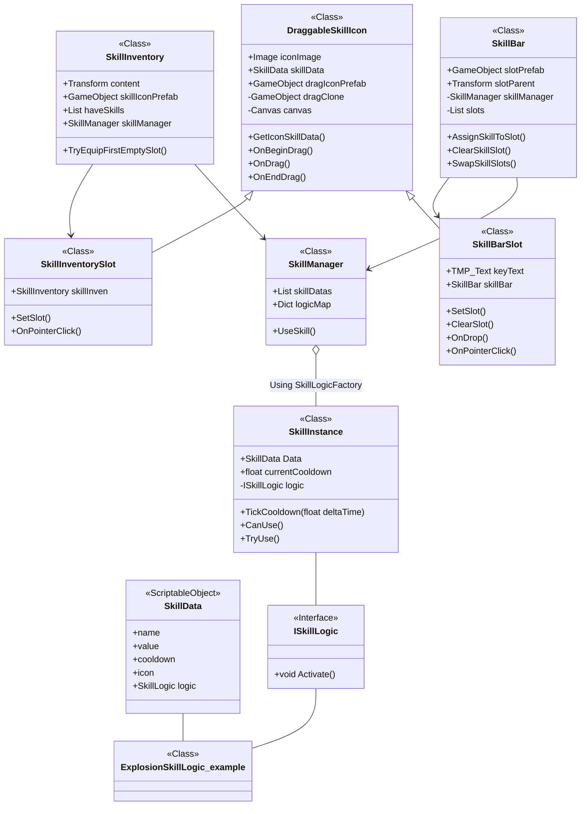
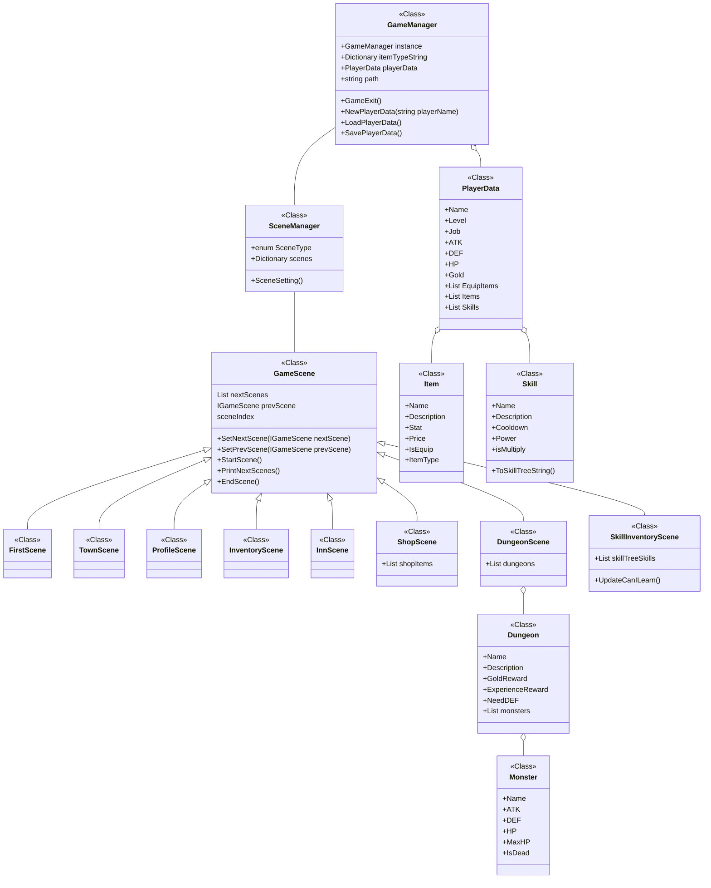

# 오늘 학습 키워드 

리팩토링, 책임
# 오늘 학습 한 내용을 나만의 언어로 정리하기 

## 중복된 부분 새로 Class 만들어서 합치기

- SkillSlotUI와 SkillIconUI 부분이 너무 비슷해보여서, 주말에 확인해 봤는데 실제로 똑같은 파트가 있었음
- 이름도 너무 모호해서, DraggableSkillIcon을 상속하는 SkillBarSlot, SkillInventorySlot 으로 나누기로함

## 책임 위임?

- 지금은 SkillManager가 스킬 하나하나에 대한 인스턴스를 리스트로 가지고 있음.
- 그런데 가만보면 스킬 바 슬롯을 비운다던가 하는 내용이 SkillManager에 들어가있음.
- 그러면 차라리 SkillBar한테 옮기는게 낫지 않나? 하는 의문.
- \>\> 그러면 스킬바의 책임이 너무 커짐.

- 다른 방향으로 고민. 지금 스킬 바 슬롯이 매니저를 직접 부르고있는데, 이게 맞나?
- 그래서 스킬 바 슬롯 -> 스킬 바 -> 스킬 매니저 순으로 호출하도록 변경하고자 함.

## 그리하여 변경된 스킬 시스템 구조

- 변경점
	1. 전반적으로 클래스 명을 명확하게 바꿈
	2. SkillInventorySlot과 SkillBarSlot의 공통 부모로 DraggableSkillIcon을 만듬
	3. 책임을 위임해서, 가능하면 최하단에 있는 SlotUI들이 Manager를 직접 부르지 않고, 상위에 있는 UI를 통해 변경하도록 함

보기도, 이해하기에도 편해짐!

## 팀프로젝트 TextRPG 만들기

 - 기존에 내가 만들었던 구조를 리팩토링 해서 사용하기로 결정

- 변경점
	1. IGameScene 삭제
	2. GameScene을 관리하는 SceneManager 생성. GameManager의 과도한 책임을 SceneManager로 분리함
	3. Skill과 Item을 상속했던 하위 클래스 삭제.
	4. (차트에는 없지만) 텍스트 입출력 관련해서 클래스 생성 예정

# 내일 학습 할 것은 무엇인지

씬 만들기 + 텍스트 렌더러 만들기?