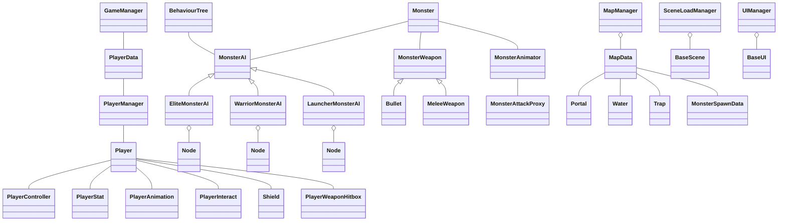

# 오늘 학습 키워드 

유니티 심화 팀 프로젝트
# 오늘 학습 한 내용을 나만의 언어로 정리하기 

## 정리된 클래스 다이어그램




### 데이터 저장/불러오기

```csharp
// PlayerManager.cs
public void SaveData()  
{  
    // Player == null => 게임 시작 창에서 끈거  
    if (Player == null) return;  
      
    Data.health = Player.stat.currentHP;  
    Data.runeOwned = runeOwned;  
    Data.coin = coin;  
    Data.shieldCount = Shield.RemainShield;  
      
    var str = JsonUtility.ToJson(Data, true);  
    File.WriteAllText(Path.SavePath, str);  
    Debug.Log("저장 완료" + Path.SavePath);  
}  
  
public void LoadData()  
{  
    if (File.Exists(Path.SavePath))  
    {  
        string str = File.ReadAllText(Path.SavePath);  
        PlayerData data =  JsonUtility.FromJson<PlayerData>(str);  
        Data = data;  
        SetData();  
    }  
    else  
    {  
        NewData();  
    }  
}  
  
public void SetData()  
{  
    for (int i = 0; i < Data.runeOwned.Length; i++)  
    {   
        SetRuneOwnedIndex(i, Data.runeOwned[i]);  
    }  
    SetCoin(Data.coin);  
    Shield.GetOldShield(Data.shieldCount);  
    Player.SetHealth(Data.health);  
}  
  
public void NewData()  
{  
    Data = new PlayerData  
    {  
        runeOwned = null,  
        coin = startCoin,  
        health = startHealth  
          
    };  
      
    var str = JsonUtility.ToJson(Data, true);  
    File.WriteAllText(Path.SavePath, str);  
    Debug.Log("저장 완료" + Path.SavePath);  
      
    LoadData();  
}
```

# 학습하며 겪었던 문제점 & 에러 

## 문제 1

- 문제&에러에 대한 정의 

Trigger Stay가 안불렸음

- 해결 방법 

rigidbody가 자고있었음 그래서 깨워줌

```csharp
if(rb.IsSleeping())  
    rb.WakeUp();
```

- 새롭게 알게 된 점 

rigidbody는 불필요한 연산을 피하기 위해 알아서 잠듬

- 이 문제&에러를 다시 만나게 되었다면? 

플레이어처럼 중요한 애는 최대한 깨어있도록 함
