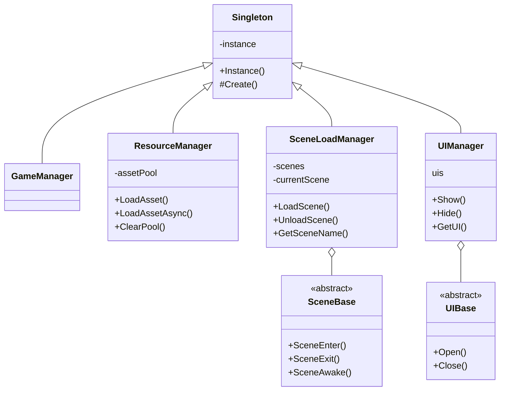

# 오늘 학습 키워드 

최종 팀 프로젝트
# 오늘 학습 한 내용을 나만의 언어로 정리하기 

### 팀원분의  XlsxToJson 해체해보기

#### 리플렉션

- 런타임에 타입의 정보나 변수 이름 등등을 알 수 있게 하는 방법.

#### OnPostprocessAllAssets

- 유니티에서 제공하는 함수
- 에셋이 변경된걸 감지할 수 있음.

#### XlsxToJsonConverter 구성도

## 프레임워크 클래스 다이어그램

