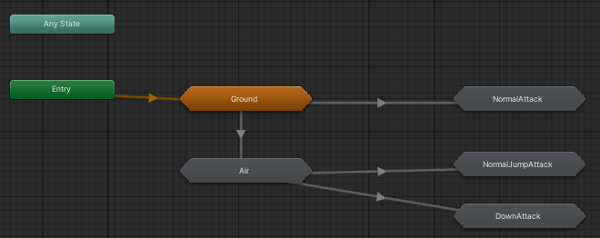

# 오늘 학습 키워드 

최종 팀 프로젝트
# 오늘 학습 한 내용을 나만의 언어로 정리하기 

## SubStateMachine을 사용해서 정리하기

- 너무 복잡하게 연결되어있던 애니메이션들을 SubStateMachine으로 깔끔하게 정리함

  

- 미리미리 정리하자.............. 나중에 후회함

# 학습하며 겪었던 문제점 & 에러 

## 문제 1

- 문제&에러에 대한 정의 

벽에 딱 붙어서 점프를 하면 점프가 매우 낮게만 됨

- 내가 한 시도 

벽에 붙어서 점프할 때는 좌우 속도를 0으로 한 후에 점프하게 했음

- 해결 방법 

PhysicsMaterial2D를 조정하여 해결했음 (팀원분 무한 감사)

- 새롭게 알게 된 점 

PhysicsMaterial2D로 마찰력을 조절할 수 있다! 

## 문제 2

- 문제&에러에 대한 정의 

- 내가 한 시도 

- 해결 방법 

- 새롭게 알게 된 점 

- 이 문제&에러를 다시 만나게 되었다면? 

# 내일 학습 할 것은 무엇인지