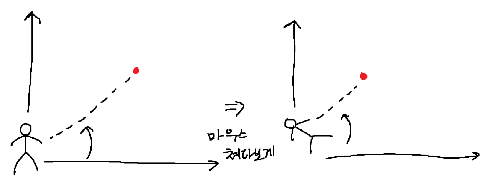
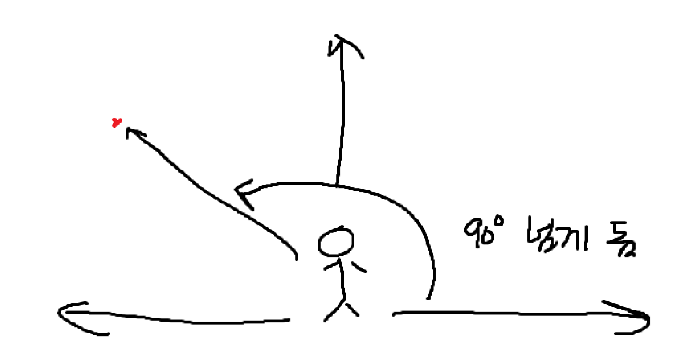
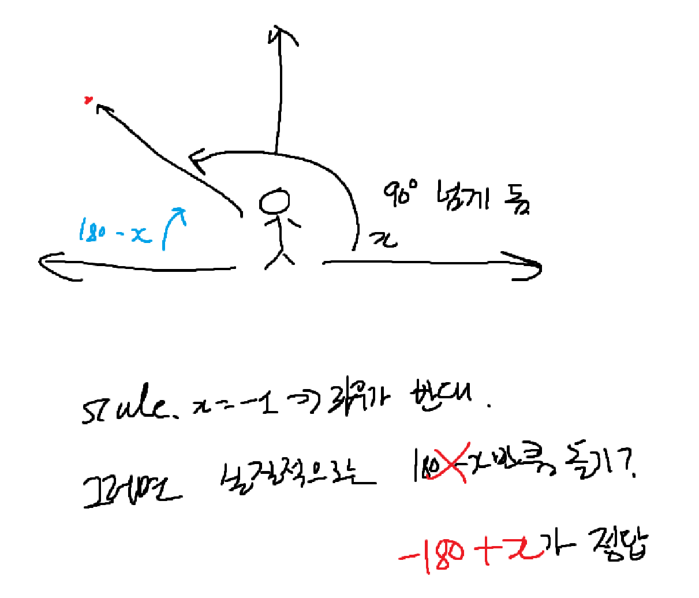
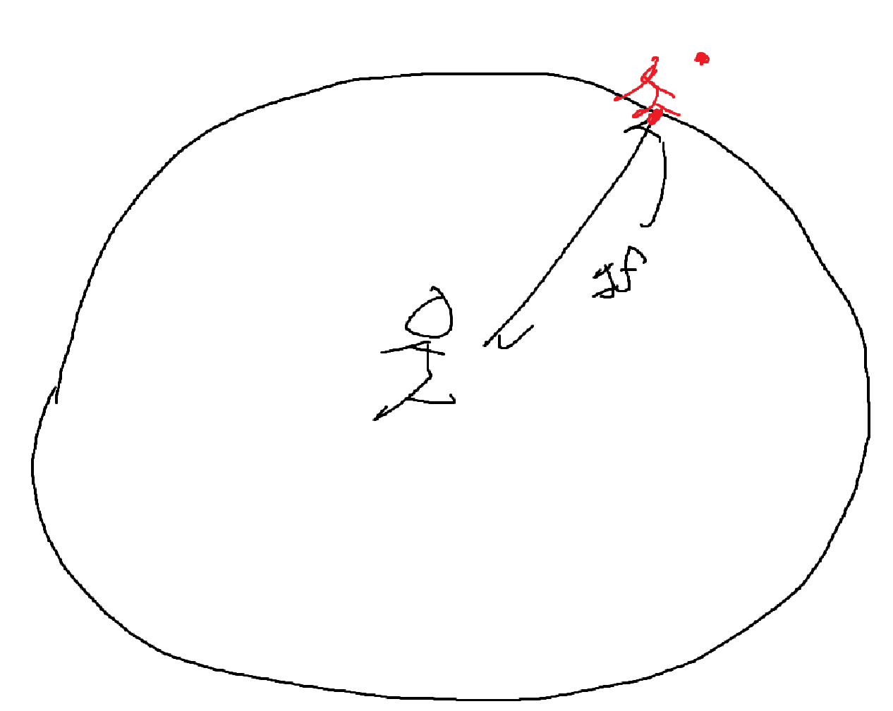
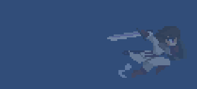

# 오늘 학습 키워드 

최종 팀 프로젝트 
# 오늘 학습 한 내용을 나만의 언어로 정리하기 

## 섬단 만들기

### 첫 번째 목표 : 애니메이션 넣기

- 성공!

### 두 번째 목표 : 마우스를 바라보도록 회전하기

  

- 플레이어가 마우스를 바라보는 벡터를 생성
- 그 벡터의 각도를 구함 (Atan 사용)
- 그리고 Rad2Deg 곱해줌

#### 문제 : 왼쪽을 보고있으면 애가 반대로 뒤집혀버림

  

- 각도를 구한걸 보니까 왼쪽이면 저렇게 90도가 넘게 나옴. 

- 해결!

### 세 번째 목표 : 이동하는 방법을 바꾸기

- AddForce로 해놨는데 그러면 안되고 일종의 컴퍼스처럼 해야됨

  

## 회피 만들기

- 성공!

# 학습하며 겪었던 문제점 & 에러 

## 문제 1

- 문제&에러에 대한 정의 

애니메이터 안에 있는 애니메이션을 못찾았음

- 해결 방법 

애니메이터 안에서 클립이 빠져있었음.

## 문제 2

- 문제&에러에 대한 정의 

- 내가 한 시도 

- 해결 방법 

- 새롭게 알게 된 점 

- 이 문제&에러를 다시 만나게 되었다면? 

# 내일 학습 할 것은 무엇인지