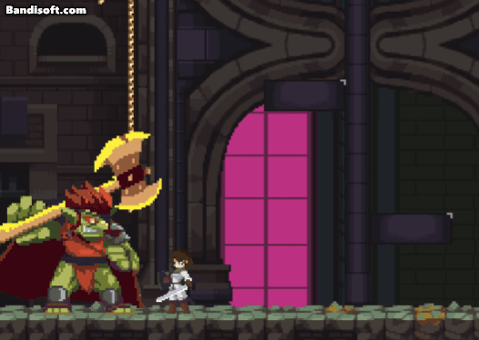

# 오늘 학습 키워드 

최종 팀 프로젝트
# 오늘 학습 한 내용을 나만의 언어로 정리하기 

## 특정 몬스터가 패링이 안됨

- 알고보니 패리 성공 시 공격 위치가 몬스터랑 부딪히지 않아서 생긴 문제
- 플레이어의 패링 공격 정도를 조절해서 해결

## Time.timeScale을 쓰지 않고 히트스탑 구현하기

- 대신에 그냥 애니메이터의 속도를 멈추기
```csharp
IEnumerator TimeStop(Animator monsterAnimator, float time)  
{  
    /*Time.timeScale = 0;*/  
    // 이거 안통함  
    /*controller.Animator.animator.speed = 0f;*/  
    monsterAnimator.speed = 0f;  
    yield return new WaitForSecondsRealtime(time);  
    /*Time.timeScale = 1;*/  
    /*controller.Animator.animator.speed = 1f;*/    
    monsterAnimator.speed = 1f;  
    justAttackCoroutine = null;  
}
```

- 다만? 왜인지 모르겠으나 플레이어 애니메이터의 경우에는 멈추질 않음. 왤까?
- ㄴㄴ 멈춤 다른 방법 찾아냄

```csharp
IEnumerator TimeStop(Animator monsterAnimator, float time)  
{  
    // 별로면 이 부분만 빼면 됨  
    controller.Animator.animator.speed = 0f;  
    monsterAnimator.speed = 0f;  
    yield return new WaitForSecondsRealtime(time);  
  
    controller.Animator.animator.speed = 1f;  
    monsterAnimator.speed = 1f;  
    justAttackCoroutine = null;  
}
```


## 색깔 바꾸기

```csharp
public override async UniTask EffectAsync(EffectOrder order, CancellationToken token, GameObject target = null)  
{  
      
    //스테이지 매니저에서 레이어 두 개 찾기 (빨강, 검정)  
    GameObject pointColorObject = StageManager.Instance.color;  
    GameObject blackColorObject = StageManager.Instance.black;  
      
    //빨강. 컬러를 이 SO의 PointColor로 바꾸기  
    //검정. 컬러를 검정으로 바꾸기  
    ChangeMapColor(pointColorObject, PointColor);  
    ChangeMapColor(blackColorObject, blackColor);  
  
    // 타겟 (맞은 몬스터)이 있으면 걔도 같이 검정색으로   
if (target != null)  
    {  
        ChangeCharacterColor(target, blackColor);  
        ChangeCharacterColor(PlayerManager.Instance.player.gameObject, blackColor);  
    }  
  
    //Duration초 동안 지속되도록 하기  
    //끝나면 원래대로 돌려놓기  
    await UniTask.Delay((int)(Duration * 1000), cancellationToken: token);  
      
    ChangeMapColor(pointColorObject, Color.white);  
    ChangeMapColor(blackColorObject, Color.white);  
    if (target != null)  
    {  
        ChangeCharacterColor(target, Color.white);  
        ChangeCharacterColor(PlayerManager.Instance.player.gameObject, Color.white);  
    }  
}  
  
private void ChangeMapColor(GameObject parent, Color color)  
{  
    if (parent.GetComponentsInChildren<SpriteRenderer>().Length != 0)  
    {  
        foreach (var renderer in parent.GetComponentsInChildren<SpriteRenderer>())  
        {  
            renderer.color = color;  
        }  
    }  
  
    if (parent.GetComponentsInChildren<Tilemap>().Length != 0)  
    {  
        foreach (var renderer in parent.GetComponentsInChildren<Tilemap>())  
        {  
            renderer.color = color;  
        }  
    }  
}
```


### 중간에 끊어지면 어떡하지? 에 대한 답변


```csharp
public override async UniTask EffectAsync(EffectOrder order, CancellationToken token, GameObject target = null)  
{  
    //스테이지 매니저에서 레이어 두 개 찾기 (빨강, 검정)  
    GameObject pointColorObject = StageManager.Instance.color;  
    GameObject blackColorObject = StageManager.Instance.black;  
    try  
    {  
       //빨강. 컬러를 이 SO의 PointColor로 바꾸기  
        //검정. 컬러를 검정으로 바꾸기  
        ChangeMapColor(pointColorObject, PointColor);  
        ChangeMapColor(blackColorObject, blackColor);  
  
        // 타겟 (맞은 몬스터)이 있으면 걔도 같이 검정색으로   
if (target != null)  
        {  
            ChangeCharacterColor(target, blackColor);  
            ChangeCharacterColor(PlayerManager.Instance.player.gameObject, blackColor);  
        }  
  
        //Duration초 동안 지속되도록 하기  
        //끝나면 원래대로 돌려놓기  
        await UniTask.Delay((int)(Duration * 1000), cancellationToken: token);  
          
    }   
    catch (OperationCanceledException)  
    {  
        Debug.LogWarning($"[이펙트: UniTask (ID : {effectId})] EffectAsync operation cancelled");  
    }  
    catch (Exception e)  
    {  
        Debug.LogError($"[이펙트: UniTask (ID : {effectId})] EffectAsync operation failed: {e}");  
    }  
    finally  
    {  
        ChangeMapColor(pointColorObject, Color.white);  
        ChangeMapColor(blackColorObject, Color.white);  
        if (target != null)  
        {  
            ChangeCharacterColor(target, Color.white);  
            ChangeCharacterColor(PlayerManager.Instance.player.gameObject, Color.white);  
        }  
    }  
}
```

- UniTask는 중간에 끊어질 경우 OperationCanceledException 이 발생함. 
- 그러면 finally를 무조건 거치기 때문에 색을 안정적으로 돌려놓을 수 있음.


## 그래서 나온 저스트 섬단 이펙트

  
