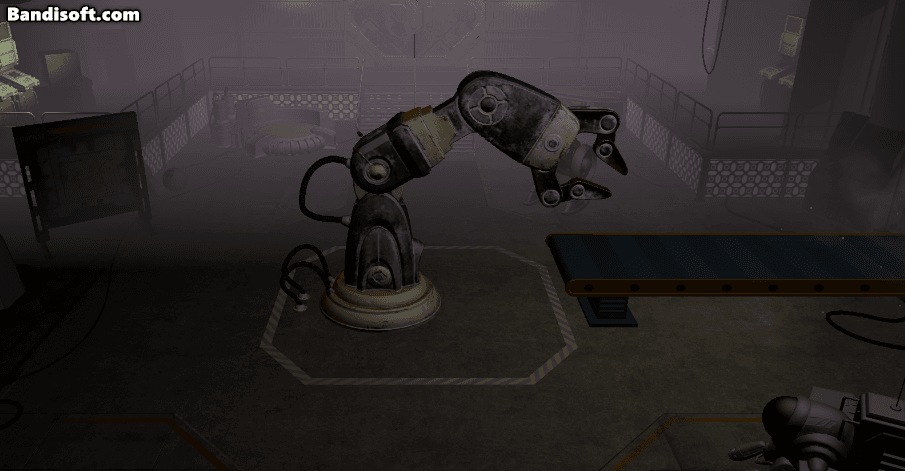
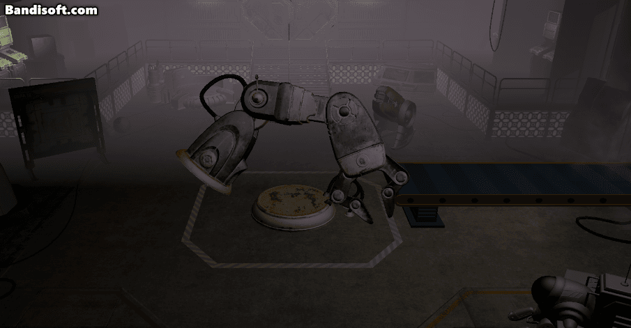
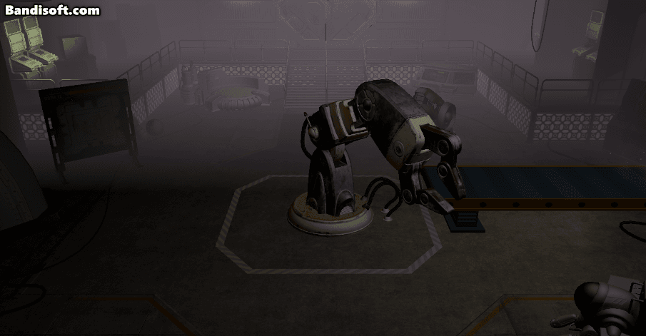

# 로봇 팔 회전하기

- Rigidbody의 AngularVelocity를 사용함
- 문제 발생 : 땅에 고정된 채로 회전하는게 아니라서 로봇 바닥부분이 드드드 하고 떨리면서 포지션이 바뀜
- 해결 시도 : AngularVelocity 대신 MoveRotation 을 써봄
```csharp
// 기존 코드
controller.BodyRb.angularVelocity =  
    (axisInput > 0 ? controller.BodyRotationAngle : -controller.BodyRotationAngle) * moveDirection;
    
// 수정 코드
float deltaAngle = controller.BodyRotationAngle * axisInput * Time.fixedDeltaTime;  
Quaternion deltaRot = Quaternion.AngleAxis(deltaAngle, RotationAxis);  
controller.BodyRb.MoveRotation(controller.BodyRb.rotation * deltaRot);

```
- 되긴 했는데.... 돌아가는 상태가 이상함


- 힌지 조인트를 써서 땅이랑 몸통을 잇기로 결정
- 근데 그랬더니 더 이상해짐

- Idle 상태에서 angularVelocity를 0으로 하니까 생긴 문제였음.

- 근데? 이젠 돌아가질 않음
- 알고보니 Motor가 Struct였는데 내가 대입을 안하고 내부 값만 바꾸고 있었음 ㅇㄴ 어쩐지 안돌아가더라
- 이제 잘 돌아감

- 근데??? 또 코드 추가하니까 이상하게 돌아가서 그냥 Transform Rotation 쓰기로 함 ㅡㅡ


# 로봇 팔 상태 관리하기


