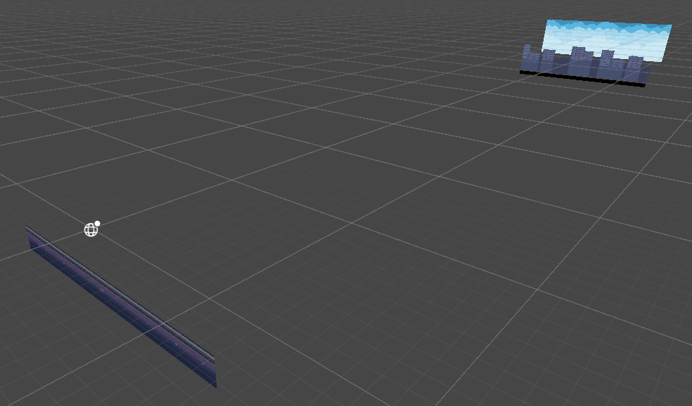

[2025 Unity 6 Challenge](2025%20Unity%206%20Challenge.md)

# 세팅

## 뭉개기 해제

- 유니티가 자체적으로 가지고있는 필터/압축을 해제해야 레트로 픽셀 느낌이 남.
    - Advanced → Filter Mode : Point(no filter)
    - Advanced → Compression : None

# 배경

## 하늘 만들기

- 3D Object → Quad 생성하기
    - Quad : 너비와 높이는 있지만 두께가 없기 때문에, 종이 역할을 함
- Quad에 Sky 스프라이트를 드래그&드롭 하면 스프라이트가 적용됨 (확장)
    - 확장이 아니고 반복으로 하고싶기 때문에, Sky 스프라이트를 클릭 → Advanced → Wrap Mode : Repeat 로 재설정
- 이후에 Materials 폴더가 생성됨
    - Material : 이미지가 요소에 적용되는 방식을 커스터마이징할 수 있게 함
- Materials 폴더 → Sky → Tiling 수정
    - Tiling x: 1, y : 1 ⇒ 현재 이 마테리얼이 적용된 오브젝트는 수평 방향(x)로 1개, 수직 방향(y)로 1개의 Sky 스프라이트로 구성되어 있다는 뜻 ⇒ 오브젝트가 커질 수록 원본 이미지가 늘어남
    - 따라서 Tiling을 수정하면 한 오브젝트가 n개의 스프라이트로 구성되도록 할 수 있음
    - Offset을 수정함으로써 맵이 무한히 진행되는 듯한 느낌을 주도록 할 수 있음

## 빌딩 만들기

- 위에서 만든 하늘 Duplicate
- Buildings로 이름 변경 후, buildings 스프라이트를 드래그&드롭하여 변경한 Quad에 적용
- png 파일인데 투명화가 적용이 되지 않고 흰색으로 나타남 ⇒ 마테리얼에서 수정 필요
- Materials 폴더 → buildings → Surface Type : Transparent로 변경
- Materials 폴더 → buildings → Tiling 수정해서 자연스럽게 바꿔주기

## 땅 만들기

- 위에서 만든 빌딩 Duplicate
- Platform으로 이름 변경 후, ground 스프라이트를 드래그&드롭하여 변경한 Quad에 적용
- 이랬더니, 빌딩의 바닥 부분에 가려져서 땅이 안보임 ⇒ 추가 설정 필요
- 2D 게임 제작에서, Z축은 깊이에 해당함. 따라서 Z축의 값을 크게 하면 더 깊게 오브젝트를 둔다는 의미임


Sky의 Z를 100, Buildings의 Z를 90, Platform의 Z를 0으로 두었을 때, 씬을 옆에서 본 결과

- 땅 Tiling도 위에서처럼 수정하기

## 빈 공간 수정하기

- sky의 위치를 좀 내렸더니, 위에 빈 공간의 색이 맘에 안듬
- 이는 main camera의 배경색임
- Main Camera → Camera → Environment → Background를 하늘의 가장 어두운 색으로 설정해주면 자연스럽게 보임

# 스크롤링 스크립트

- Assets 폴더에 Scripts 생성 후 MonoBehaviour 생성 → 파일명 BackgroundScroll
- sky, buildings, platform에 BackgroundScroll 추가하기
- 스크롤 속도는 sky < buildings < platform 으로 진행할 예정이기 때문에, 각 오브젝트의 인스펙터에서 속도를 커스텀 할 수 있도록 해야함

```csharp
public class BackgroundScroll : MonoBehaviour
{
    [Header("Settings")] // 헤더 설정
    [Tooltip("How fast should the texture scroll?")] // 툴팁 설정 (커서 대고있음 보임)
    public float scrollSpeed; // 오브젝트 인스펙터에서 보일 수 있도록 함
    ...
}
```


 
이렇게 코드짜면 보이는 모습

- 스크립트는 텍스쳐를 렌더링(화면에 보이게 하는것)하는 컴포넌트(Mesh Renderer)에 대한 권한이 필요

```csharp
...
		[Header("References")]
    public MeshRenderer meshRenderer;
...
```

- 이후 각 오브젝트에 맞는 메쉬 렌더러를 드래그&드롭으로 추가하기
- 업데이트 때 마다 마테리얼의 오프셋을 수정해 무한 스크롤처럼 보이게 하기

```csharp
void Update()
    {
        meshRenderer.material.mainTextureOffset += new Vector2(scrollSpeed, 0);
    }
```

- 안 움직이는 것처럼 보임.. ⇒ 프레임 당 호출되는게 update인데, 지금 초당 프레임이 400이 넘어감 ⇒ 너무 빨라서 안보임
    - 초당 프레임에 의존하여 만들고싶지 않음. 대신 초 단위로 움직이게 하고싶음 ⇒ scrollSpeed * Time.deltaTime

```csharp
void Update()
    {
        meshRenderer.material.mainTextureOffset += new Vector2(scrollSpeed * Time.deltaTime, 0);
    }
```

- Time.deltaTime : 이전 프레임에서 지금 프레임까지의 초 단위 간격
    - FPS가 f 일 때, 초 간격은 1/f
    - ex. 2 fps → 초 간격 = 1/2 = 0.5
    - ex 2. 100 fps → 초 간격 = 1/100 = 0.01
    - 1초마다 offset이 2씩 움직이도록 하고싶음 ⇒ 2 * Time.deltaTime
    - 만약에 100 fps일때 ⇒ 1 프레임 (update) 때마다 2 * 0.01 씩 offset을 바꿈
    - 1초가 됨 = 100 fps가 다 돌았음 = 2_0.01_100 = 2!
    - 따라서 원하는 단위 숫자 * Time.deltaTime을 하면 초 단위로 목표를 설정할 수 있음!
- 이후 직접 실행해 보면서 sky, buildings, platform에 맞는 scroll speed를 조정
    - 나는 sky = 0.1, buildings = 0.3, platform = 0.8로 진행했음