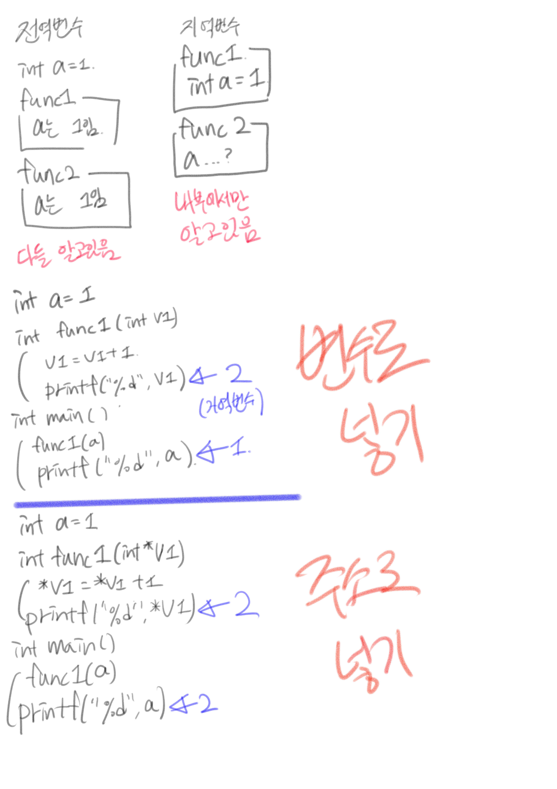

# C 프로그래밍 - 11주차 : 함수

# 함수의 이해

- 함수 : 무엇을 넣으면 어떤 것을 돌려줌
- 함수를 사용할 때의 장점 :
	- 코드의 모듈화 : 함수를 기능별로 작성하여 필요한 기능만 조합할 수 있다.
	- 코드의 간략화 : 반복되는 문장을 밖으로 빼냄으로써 C 소스를 간결하게 만든다.
	- 코드의 재사용화 : 한 번 작성한 함수를 다시 사용할 수 있다.
	- 코드의 쉬운 수정 : 프로그램의 오류를 수정하기가 쉽다.

- 함수의 기본 형태 : 매개변수(인수)를 받아 가공하고 처리한 후 반환값을 돌려줌

```c
int plus(int v1, v2) { // int : 반환값의 타입, () : 매개변수 
	int result;
	result = v1 + v2;
	return result; // result : 반환값
}

...

hap = plus(100, 200); // hap 변수에 반환값이 들어감
```

# 지역변수와 전역변수

- 지역변수 : 한정된 지역(local)에서만 사용되는 변수
- 전역변수 : 프로그램 전체(global)에서 사용되는 변수
- 함수 안에서 선언된 변수는 함수를 나가게 되면 사용하지 못함 (지역변수)

# 함수의 반환값과 매개변수

- 반환값이 있는 함수 : 함수를 실행한 결과값은 함수의 데이터 형을 따름
- 반환값이 없는 함수 : void형 함수를 호출할 때에는 함수 이름만 씀

- 매개변수 전달 방법 
	- 값으로 전달 (call by value) : 값 자체를 함수에 넘김. 원래 값을 전달한 곳에는 아무 영향 없음
	- 주소(참조)의 전달 (call by reference) : 주소를 함수에 넘김. 원래 값을 전달한 곳에도 영향을 미칠 수 있음


아래는 공부할 때 적은 내용




