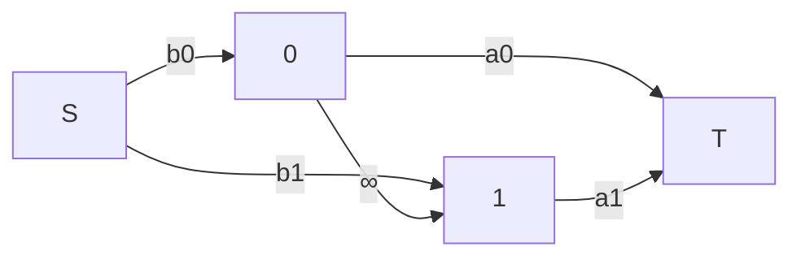

# 용어 정의

그래프 자료구조를 탐색하는 방법들

깊이 우선 탐색 (Depth First Search, DFS) : 시작 노드의 자식의.. 자식의.. 자식부터 탐색
- Stack 자료구조 활용

너비 우선 탐색 (Breadth First Search, BFS) : 시작 노드의 자식들을 먼저 탐색한 후 자식의 자식들 탐색
- Queue 자료구조 활용

전위 순회 : v의 후손이 나중에 나옴. (재귀식 호출 전에 작업하면 전위 순회)

후위 순회 : v의 후손이 먼저 나옴. (재귀식 호출 후에 작업하면 후위 순회)

밀집 그래프 : 꼭짓점의 수보다 변의 수가 많은 그래프. (반대는 희소 그래프)

## 구현 예시

### DFS / BFS 간단한 버전

```c++
void GraphSearch(const Graph &G, int start) {
	int N = (int)G.size();
	vector<bool> seen(N, false);
	stack<int> todo; // BFS일 땐 queue<int> todo;
	seen[start] = true;
	todo.push(start);
	while(!todo.empty()) {
		int v = todo.front();
		todo.pop();
		for(int next_v : G[v]){
			if(seen[next_v]) continue;
			seen[next_v] = true;
			todo.push(next_v);
		}
	}
	
}
```

### 재귀로 DFS 만들기

```c++
vector<bool> seen;
void DFS(const Graph &G, int start) {
	seen[start] = true;
	for(auto next_v : G[start]){
		if(seen[next_v]) continue;
		DFS(G, next_v);
	}
}
```

### s-t 패스 찾기 (DFS)

```c++
vector<bool> seen;
void DFS(const Graph &G, int start) {
	seen[start] = true;
	for(auto next_v : G[start]) {
		if(seen[next_v]) continue;
		DFS(G, next_v);
	}
}

int main() {
	int N, M;
	cin << N << M;
	Graph G(N);
	for(int i = 0; i < M; i++){
		int a, b;
		cin << a << b;
		G[a].push_back(b);
		G[b].push_back(a);
	}
	seen.assign(N, false);
	int start, end;
	cin << start << end;

	DFS(G, start);
	if(seen[end]) cout << "Yes" << endl;
	else cout << "No" << end;
}
```

### 이분 그래프 판정 (DFS)

```c++
vector<int> colors;
bool DFS(const Graph &G, int v, int color){
	colors[v] = color;
	for(auto next_v : G[v]) {
		if(colors[next_v] != -1) {
			if(colors[next_v] == color) return false;
			continue;
		}
		if(!DFS(G, next_v, 1-color)) return false;
	}
	return true;
}

int main() {
	... 
	colors.assign(N, -1);
}
```

### 위상 정렬 (DFS)

위상 정렬 : 사이클이 없는 유향 그래프에서, 각 꼭짓점이 변의 방향을 따르도록 정렬하는 것

```c++
vector<int> result;
vector<bool> seen;
void DFS(const Graph &G, int start) {
	seen[start] = true;
	for(auto next_v : G[start]){
		if(seen[next_v]) continue;
		DFS(G, next_v);
	}
	result.push_back(start);
}

int main() {
	for(int v = 0; v < N; v++){
		if(seen[v]) continue;
		DFS(G, v);
	}
	reverse(result.begin(), result.end());
}
```

### 루트 없는 트리 탐색 (DFS)

```c++
void DFS(const Graph &G, int start, int parent = -1) {
	for(auto next_v : G[start]) {
		if(next_v == start) continue;
		DFS(G, next_v, start);
	}
}
```

# 최단 경로 문제

주어진 그래프에서 시작 꼭짓점 s, 끝 꼭짓점 t가 있을 때 s-t 패스의 최단 경로를 구하라.

| 그래프 유형                                  | 알고리즘        |
| --------------------------------------- | ----------- |
| 비가중 그래프                                 | BFS         |
| DAG (Directed Acyclic Graph, 사이클 없는 유향) | DP (위상정렬 순) |
| 가중치가 모두 양수                              | 다익스트라       |
| 가중치 중 음수 있음                             | 벨만-포드       |

## 다익스트라

이미 최단 경로가 확정된 꼭짓점 집합 S가 있음.
1. S에 포함된 꼭짓점 v의 dist\[v\]는 최단경로임
2. S에 포함되지 않은 꼭짓점들 중 dist\[v\]가 최소인 꼭짓점을 찾음
3. v를 S에 넣고 완화함

### 구현 예시

```c++
struct Edge{
	int to, weight;
	Edge(int t, int w) : to(t), weight(w) {}
}'

using Graph = vector<vector<Edge>>

vector<bool> visited;
vector<int> dist;
dist[start] = 0;
for(int iter = 0; iter < N; iter++){
	int min_dist = INF;
	int min_v = -1;
	for(int v = 0; v < N; v++){
		if(!visited[v] && dist[v] < min_dist){
			min_dist = dist[v];
			min_v = v;
		}
	}
	if(min_v == -1) break;
	for(auto next_v : G[min_v]){
		relex(dist[next.to], dist[min_v] + next.weight);
	}
	visited[min_v] = true;
}
```

## 고속화 다익스트라

다익스트라 + 힙.
d\[v\]가 최소값인 v를 찾을 때 힙을 활용함

### 구현 예시

```c++
vector<int> dist(N, INF);
dist[start] = 0;
priority_queue<pair<long long, int>, vector<pair<long long, int>>, greater<pair<long long, int>>> h;
h.push(start);
while(!h.empty()) {
	int v = h.top().second;
	long long d = h.top().first;
	h.pop();
	if(d > dist[v]) continue;
	for(auto next_v : G[v]){
		if(relex(dist[next_v.to], dist[v] + next_v.weight)){
			h.push(next_v);
		}
	}
}
```


## 벨만-포드

음의 닫힌 경로가 없다면, 아무리 많이 완화해도 V-1 번 완화한다
-> V번 이상의 완화가 있으면 그건 음의 닫힌 경로가 있다는 뜻

### 구현 예시

```c++
const long long INF = 1 << 60;
struct Edge{
	int to;
	long long weight;
	Edge(int t, long long w) : to(t), weight(w) {}
};
using Graph = vector<vector<Edge>>
int main() {
	// 입력 생략
	bool exist_neg_cycle = false;
	vector<long long> dist(N, INF);
	dist[start] = 0;
	for(int iter = 0; iter < N; iter++) {
		bool updated = false;
		for(int v = 0; v < N; v++) {
			if(dist[v] == INF) continue;;
			for(auto next_v : G[v]){
				if(relex(dist[next_v.to], dist[v] + next_v.weight)) updated = true;
			}
		}
		if(!updated) break;
		if(iter == N - 1 && updated) exist_neg_cycle = true;
	}
}
```

## 플로이드-워셜

모든 쌍의 최단 경로를 구하려고 할 때 사용
DP로 풀 수 있음
dp\[k\]\[i\]\[j\] : i 꼭짓점부터 j 꼭짓점까지 이동하는데 k 꼭짓점만 거쳐서 이동한 최소 경로
실제로 3차원으로 만들 필요는 없음. 그냥 k 감안해서 2차원으로 만들면 됨

```c++
vector<vector<long long>> dist (N, vector<long long>(N, INF));
for(int m = 0; m < M; m++) {
	int a, b;
	long long w;
	cin << a << b << w;
	dist[a][b] = w;
}
for(int v = 0; v < N; n++) {dist[v][v] == 0;}
for(int k = 0; k < N; k++) {
	for(int i = 0; i < N; i++) {
		for(int j = 0; j < N; j++) {
			relex(dist[i][j], dist[i][k] + dist[k][j]);
		}
	}
}

bool exist_neg_cycle = false;
for(int v = 0; v < N; v++) {
	if (dist[v][v] < 0) exist_neg_cycle = true;
}

```

# 최소 신장 트리 문제

신장 트리 : 그래프 G의 부분 그래프이자 트리인 것 중에서 G의 모든 꼭짓점이 이어진 것.

최소 신장 트리 : 신장 트리 중 모든 변의 가중치의 합이 최소인 것

컷 : 그래프 G=(V, E)에서 컷은 꼭짓점 집합 V를 (X, Y) 집합으로 나누는 것

컷 변 : 쪼개진 꼭짓점 집합 X, Y 사이를 잇는 변

컷 집합 : 컷 변의 전체 집합

기본 사이클 : 연결 무향그래프 G의 신장트리 T에서 T에 포함되지 않은 변 e를 추가해 사이클화 한것  
- 이 때, 방금 추가한 변 e는 기본 사이클에 포함된 변 중 가장 가중치가 크다  

기본 컷 집합 : 연결 무향그래프 G의 신장트리 T에서 T에 포함된 변 e를 삭제해서 생긴 컷 집합.  
- 이 때, 방금 삭제한 변 e는 기본 컷 집합에 포함된 변 중 가장 가중치가 작다  

## 크루스칼

변을 가중치 오름차순으로 정렬하고, 순서대로 변 집합에 넣다가 사이클이 생기면 폐기함  

### 구현 예시

```c++
// Union-Find 구현 생략
using Edge = pair<int, pair<int, int>>; // weight, from, to
int main() {
	int N, M;
	cin << N << M;
	vector<Edge> edges(M);
	for(int i = 0; i < M; i++){
		int u, v, w;
		cin << u << v << w;
		edges.push_back(Edge(w, make_pair(u, v)));
	}
	sort(edges.begin(), edges.end());
	long long result = 0;
	
}
```

# 최대 흐름 문제

변 연결도 : 꼭짓점 S에서 T까지 서로 변을 공유하지 않는 (변 서로소인) s-t 패스의 개수  

용량 : 각 변에서 한 번에 흐를 수 있는 유량  

컷 / 컷 집합 : 무향 그래프에서의 설명과 동일함  

컷 용량 : 컷 집합에 속한 변의 개수  

최소 컷 문제 : 특정 컷 중에 용량이 최소인 것  

- 약 쌍대성 : 변 서로소인 s-t 패스의 최대 개수 <= s-t 최소 컷 용량  
- 강 쌍대성 : 변 서로소인 s-t 패스의 최대 개수 == s-t 최소 컷 용량  

증가 패스 : s-t 패스로 사용된 변에 역류 (반대 방향 이동)를 허용해 추가 가능한 s-t 패스  

잔여 그래프 : s-t 패스의 모든 변을 역으로 뒤집은 그래프  

최대 흐름 문제 : 각 변 e가 용량 c(e)를 가지는 경우, 공급지 S에서 목적지 T까지 물건을 최대한 많이 보내는 문제. 이 때 최대 운반량 c(e)가 있고, s와 t 이외의 모든 다른 꼭짓점은 물류가 계속 흘러야 한다. s/t 제외 꼭짓점에서 들어오는 유량과 나가는 유량이 같을 때의 최대 총유량 흐름을 최대 흐름이라고 하고, 최대 흐름 문제는 이를 찾는 문제이다.

흐름의 성질 : 임의의 컷 (S, T)에 대해 S -> T 방향의 변 e 유량 x(e) 총합 - T -> S 방향의 변 e' 유량 x(e') 총합 = 흐름의 총유량

최대 유량 최소 컷 정리 : 최대 흐름 총유량 = s-t 컷 최소 용량

## 포드-풀커슨 

최대 흐름 문제를 해결하는데 사용가능
만약 u->v 방향 변 e의 용량이 c(e) 일때,
크기 x(e)의 흐름이 흐르면
v->u방향으로 최대 x(e)만큼 흐름을 되돌릴 수 있다.

=> 잔여그래프 G' 위의 s-t 패스가 없어질 때 까지 흐름을 보낸다.   
이때 역변이 필요함!!  

```c++
struct Graph{
	struct Edge{
		// rev : 역변 찾을때 필요함
		int rev, from, to, capacity
		Edge(int r, int f, int t, int c) : rev(r), from(f), to(t), capacity(c) {}
	};
	vector<vector<Edge>> list;
	Graph(int n) : list(N) {}
	size_t size() { return list.size(); }
	vector<Edge> &operator [] (int i) { return list[i]; }
	
	// 역변 구하기
	Edge& RevEdge(const Edge &e) { return list[e.to][e.rev]; }
	
	// 흐름 흘리기
	void RunFlow(Edge &e, int f) {
		list[e.from][e.to] -= f;
		list[e.to][e.rev] += f;
	}

	void AddEdge(int from, int to, int cap){
		int revFrom = list[from].size(); // 역변은 리스트 뒤에 붙임
		int revTo = list[to].size();
		list[from].push_back(Edge(revFrom, from, to, cap));
		list[to].push_back(Edge(revTo, to, from, 0)); // 역변은 초기 유량 0임
	}
}

struct FordFulkerson {
	static const INF = 1 << 30;
	vector<int> seen;

	// 시작점 s, 도착점 t, 
	// 반환값 = 흘린 유량
	int DFS(Graph &G, int s, int t, int f) {
		if(s==t) return f;
		seen[s] = true;
		for(auto &next_v : G[s]) {
			if(seen[next_v.to]) continue;
			if(next.cap = 0) continue; // 용량이 0이면 없는거임
			// 다음 변의 용량이랑 흘릴려는 유량 중에 더 작은걸로 흘림
			int flow = DFS(G, next_v.to, t, min(f, next_v.cap));
			// flow 0이면 못흘림
			if(flow == 0) continue;
			G.RunFlow(next_v, flow);
			return flow;
		}
		return 0;
	}

	int Solve(Graph &G, int s, int t) {
		int result = 0;
		while(true) {
			seen.assign((int)G.size(), 0);
			int flow = DFS(G, s, t, INF);
			if(flow == 0) return result;
			result += flow;
		}
	}
}
```


## 선택 문제

선택을 그래프로 바꿔서 풀 수 있음


|                  | 버튼 1을 누름 | 버튼 1을 안누름 |
| ---------------- | -------- | --------- |
| **버튼 0을 누름**     | a0 + a1  | ∞ (불가능)   |
| **버튼 0을 누르지 않음** | b0 + a1  | b0 + b1   |


위와 같은 선택표가 있을 때, 이를 그래프로 바꾸면 아래와 같은 모양이 나옴




선택에 대한 최소비용을 찾는 문제에서 그래프를 사용해 풀 수 있다

# 참고자료

[문제 해결력을 높이는 알고리즘과 자료 구조](https://www.yes24.com/Product/Goods/107514892)